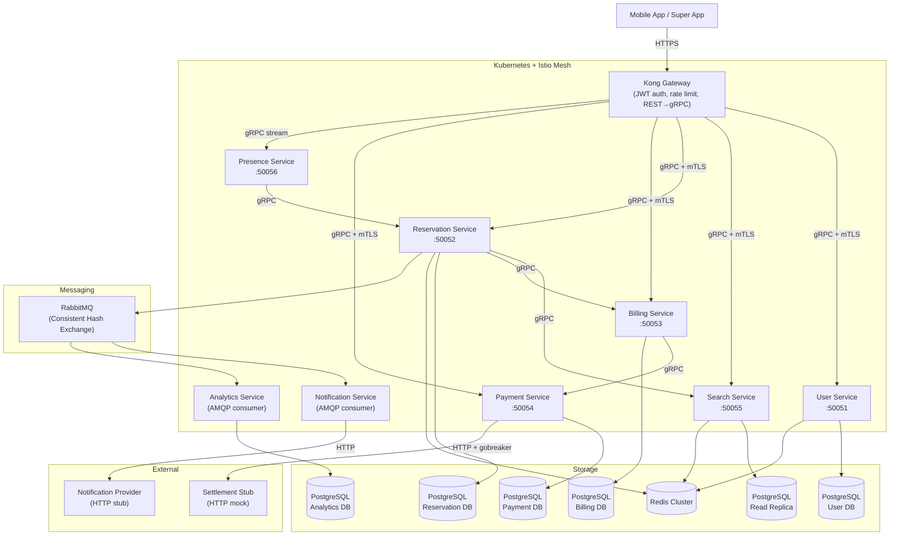
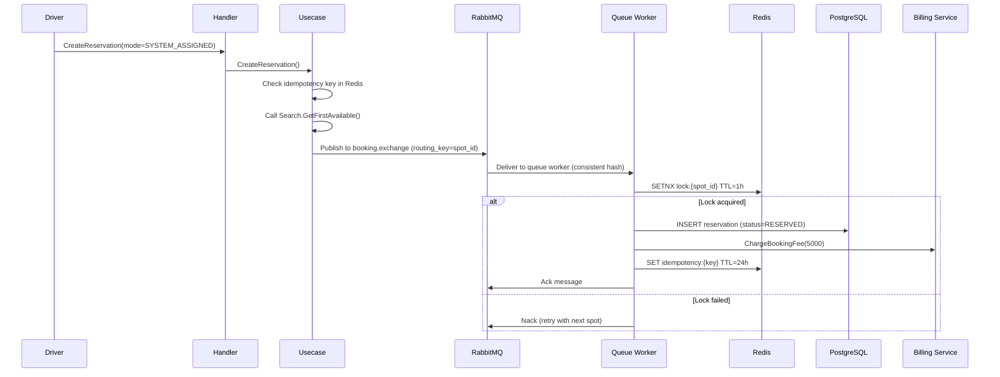

# Design Document: ParkirPintar Backend

## Overview

ParkirPintar is a smart parking reservation and billing backend for a single facility (5 floors, 150 car spots, 250 motorcycle spots). The system is implemented as 8 Go microservices in a monorepo, communicating via gRPC (service-to-service) and RabbitMQ (event-driven). Each service follows Clean Architecture with handler → usecase → repository → model dependency direction.

This design document covers the completion of all 8 service skeletons that already exist under `services/`. The skeleton code has handler structs, usecase interfaces, repository implementations, and domain models in place. The work involves filling in TODOs: password hashing, JWT issuance/validation, RabbitMQ integration, Redis caching, gRPC client adapters, settlement stub HTTP client, auth interceptor, database migrations, and the expiry worker.

### Key Design Decisions

| Decision | Rationale |
|---|---|
| bcrypt cost 12 for passwords | Balance between security and latency (~250ms per hash) |
| HS256 JWT with Redis blacklist | Simple symmetric signing; blacklist enables immediate revocation |
| RabbitMQ Consistent Hash Exchange | Serializes concurrent bookings per spot, eliminating race conditions |
| Redis SETNX for distributed locks | Atomic lock acquisition prevents double-booking |
| gorules/JDM pricing engine with Go fallback | Hot-reloadable rules; fallback ensures zero-downtime if rules DB is unavailable |
| gobreaker circuit breaker on Payment Service | Protects against settlement stub failures cascading upstream |
| Idempotency via Redis with 24h TTL | Prevents duplicate reservations/invoices from network retries |
| Database-per-service | Each service owns its schema; no cross-service table access |

## Architecture



### Service Communication Matrix

| From | To | Protocol | Purpose |
|---|---|---|---|
| Reservation | Search | gRPC | GetFirstAvailable (system-assigned mode) |
| Reservation | Billing | gRPC | ChargeBookingFee, ApplyPenalty |
| Billing | Payment | gRPC | CreatePayment (on checkout) |
| Presence | Reservation | gRPC | CheckIn (geofence trigger) |
| Reservation | RabbitMQ | AMQP publish | Booking messages, domain events |
| Billing | RabbitMQ | AMQP publish | checkout.completed/failed events |
| Notification | RabbitMQ | AMQP consume | Domain event forwarding |
| Analytics | RabbitMQ | AMQP consume | Transaction event storage |
| Payment | Settlement Stub | HTTP | QRIS QR generation, status check |
| Notification | Notification Provider | HTTP | Event forwarding |

## Components and Interfaces

### 1. User Service (`services/user/`)

**Existing skeleton**: Handler, usecase, repository, model all present. Missing: password hashing, JWT issuance, refresh token rotation, logout/blacklist, Logout/RefreshToken handler methods.

#### Files to Modify

| File | Changes |
|---|---|
| `services/user/internal/model/user.go` | Add `PasswordHash string` field |
| `services/user/internal/repository/user_repository.go` | Add `StoreRefreshToken`, `GetRefreshToken`, `DeleteRefreshToken` methods |
| `services/user/internal/repository/user_postgres.go` | Implement new repo methods; update `Create` to store password_hash; add `SetTokenBlacklist` with dynamic TTL |
| `services/user/internal/usecase/user_usecase.go` | Add bcrypt hashing in Register; JWT issuance in Authenticate; add `Logout`, `RefreshToken`, `ValidateToken` methods |
| `services/user/internal/handler/user_handler.go` | Implement `Logout` and `RefreshToken` RPC handlers; fix Login to return real JWT |
| `services/user/cmd/main.go` | Uncomment and wire pgxpool, Redis, repo, usecase, handler; register gRPC service |

#### New Files

| File | Purpose |
|---|---|
| `services/user/internal/usecase/jwt.go` | JWT helper: `GenerateAccessToken(driverID)`, `ParseAccessToken(token)`, `GenerateRefreshToken()` using `golang-jwt/jwt/v5` |
| `services/user/pkg/interceptor/auth.go` | Unary gRPC interceptor: extract JWT from `authorization` metadata, validate signature/expiry, check blacklist via Redis, inject `driver_id` into context. Skip for Register/Login RPCs. |
| `services/user/migrations/001_create_users.sql` | CREATE TABLE users with id, license_plate, vehicle_type, password_hash, name, phone_number, created_at, updated_at; UNIQUE(license_plate, vehicle_type) |

#### JWT Design

```go
// Access token claims
type Claims struct {
    jwt.RegisteredClaims
    // sub = driver_id (in RegisteredClaims.Subject)
    // jti = uuid (in RegisteredClaims.ID)
    // exp = 1 hour from now
}

// Signing: HS256 with JWT_SECRET env var
// Refresh token: opaque UUID stored in Redis key "refresh:{token}" → driver_id, TTL 7 days
// Blacklist: Redis key "blacklist:{jti}" → "1", TTL = remaining token expiry
```

### 2. Reservation Service (`services/reservation/`)

**Existing skeleton**: Handler, usecase, repository, model present. Missing: RabbitMQ integration for war booking, Search Service gRPC client call, hold validation for user-selected mode, expiry worker, event publishing, lock release on cancel/checkin.

#### Files to Modify

| File | Changes |
|---|---|
| `services/reservation/internal/usecase/reservation_usecase.go` | Add Search gRPC client dependency; add RabbitMQ publisher dependency; implement system-assigned mode (call Search → publish to exchange); implement user-selected mode (validate hold → publish); add lock release in CancelReservation and CheckIn; set checkin_at timestamp; call Billing gRPC client for booking fee, penalty |
| `services/reservation/internal/repository/reservation_repository.go` | Add `ReleaseLock(ctx, spotID)`, `GetHoldOwner(ctx, spotID)`, `SetCheckinAt(ctx, id, time)`, `GetExpiredReservations(ctx)` methods |
| `services/reservation/internal/repository/reservation_postgres.go` | Implement new repo methods; add `ReleaseLock` (Redis DEL), `GetHoldOwner` (Redis GET), `SetCheckinAt` (SQL UPDATE) |
| `services/reservation/internal/handler/reservation_handler.go` | Extract driver_id from gRPC context (set by auth interceptor) instead of hardcoded TODO |
| `services/reservation/cmd/main.go` | Wire pgxpool, Redis, RabbitMQ, Search gRPC client, Billing gRPC client, repo, usecase, handler; register gRPC service; start expiry worker goroutine |

#### New Files

| File | Purpose |
|---|---|
| `services/reservation/internal/usecase/expiry_worker.go` | Background goroutine: poll Redis for expired `lock:*` keys via keyspace notifications or periodic scan; for each expired lock where reservation status=RESERVED, update to EXPIRED, call Billing for no-show fee, publish `reservation.expired` event |
| `services/reservation/internal/adapter/search_client.go` | gRPC client adapter wrapping `SearchServiceClient.GetFirstAvailable()` |
| `services/reservation/internal/adapter/billing_client.go` | gRPC client adapter wrapping `BillingServiceClient.ChargeBookingFee()`, `ApplyPenalty()`, `StartBillingSession()` |
| `services/reservation/internal/adapter/publisher.go` | RabbitMQ publisher: publish booking messages to `booking.exchange` (x-consistent-hash) with routing_key=spot_id; publish domain events to `events.exchange` (topic) |
| `services/reservation/internal/usecase/queue_worker.go` | AMQP consumer for booking queue: receive message → acquire Redis lock → create reservation → charge booking fee → store idempotency key → ack/nack |
| `services/reservation/migrations/001_create_reservations.sql` | CREATE TABLE reservations; CREATE TABLE spots (with seed data for 400 spots) |

#### War Booking Flow



### 3. Billing Service (`services/billing/`)

**Existing skeleton**: Handler, usecase, repository, model present. Fallback Go pricing engine exists. Missing: gorules engine integration, idempotency for checkout, Payment Service gRPC client call, noshow_fee and cancellation_fee handling in Checkout.

#### Files to Modify

| File | Changes |
|---|---|
| `services/billing/internal/usecase/billing_usecase.go` | Integrate gorules engine (load from DB, hot-reload); add Payment gRPC client dependency; implement idempotency check in Checkout (Redis); include noshow_fee and cancellation_fee in total calculation; call Payment.CreatePayment on checkout; publish checkout.completed/failed events to RabbitMQ |
| `services/billing/internal/repository/billing_repository.go` | Add `GetByIdempotencyKey(ctx, key)`, `SetIdempotencyKey(ctx, key, invoiceID)` methods |
| `services/billing/internal/repository/billing_postgres.go` | Implement idempotency methods (requires Redis client addition); add `idempotency_key` column handling |
| `services/billing/internal/model/billing.go` | Add `IdempotencyKey`, `PaymentID`, `QRCode` fields to BillingRecord; add `NoshowFee` field to PricingOutput |
| `services/billing/cmd/main.go` | Wire pgxpool, Redis, Payment gRPC client, RabbitMQ publisher, repo, usecase, handler; register gRPC service |

#### New Files

| File | Purpose |
|---|---|
| `services/billing/internal/adapter/payment_client.go` | gRPC client adapter wrapping `PaymentServiceClient.CreatePayment()` |
| `services/billing/internal/adapter/publisher.go` | RabbitMQ publisher for checkout events |
| `services/billing/internal/usecase/pricing.go` | Extracted pricing engine: gorules integration with `Evaluate(PricingInput) PricingOutput`; fallback to pure Go `evaluatePricing()` if gorules unavailable |
| `services/billing/migrations/001_create_billing.sql` | CREATE TABLE billing_records; CREATE TABLE pricing_rules (with seed JDM rule) |

### 4. Payment Service (`services/payment/`)

**Existing skeleton**: Handler, usecase (with gobreaker), repository, model present. Missing: settlement stub HTTP client implementation, circuit breaker fallback for OPEN state.

#### Files to Modify

| File | Changes |
|---|---|
| `services/payment/internal/usecase/payment_usecase.go` | Add fallback logic when circuit breaker is OPEN: return Payment with status=PENDING, no QR code; handle idempotency for CreatePayment |
| `services/payment/cmd/main.go` | Wire pgxpool, settlement client, repo, usecase, handler; register gRPC service |

#### New Files

| File | Purpose |
|---|---|
| `services/payment/internal/adapter/settlement_client.go` | HTTP client implementing `settlementClient` interface: `RequestQRIS()` POSTs to settlement stub URL, parses QR code from response; `CheckStatus()` GETs payment status. Uses `net/http` with timeouts. |
| `services/payment/migrations/001_create_payments.sql` | CREATE TABLE payments |

### 5. Search Service (`services/search/`)

**Existing skeleton**: Handler, usecase, repository, model present. Missing: Redis cache implementation (TODO comments in spot_postgres.go).

#### Files to Modify

| File | Changes |
|---|---|
| `services/search/internal/repository/spot_postgres.go` | Implement Redis cache-aside pattern: check Redis first (`availability:{floor}:{type}`, TTL 10s), return cached result if hit; on miss, query PostgreSQL read replica, serialize result to Redis, return. Same for `GetFirstAvailable`. |
| `services/search/cmd/main.go` | Wire pgxpool (read replica), Redis, repo, usecase, handler; register gRPC service; fix port to 50055 |

### 6. Presence Service (`services/presence/`)

**Existing skeleton**: Handler, usecase, model present. Missing: geofence data loading, proper check-in triggering, GEOFENCE_EXITED detection.

#### Files to Modify

| File | Changes |
|---|---|
| `services/presence/internal/usecase/presence_usecase.go` | Load geofence data from config/DB on startup; track per-stream state (last known spot) to detect GEOFENCE_EXITED; improve ProcessLocation to distinguish GEOFENCE_ENTERED vs CHECKIN_TRIGGERED vs WRONG_SPOT_DETECTED |
| `services/presence/cmd/main.go` | Wire Reservation gRPC client, geofence config, usecase, handler; register gRPC service; fix port to 50056 |

#### New Files

| File | Purpose |
|---|---|
| `services/presence/internal/adapter/reservation_client.go` | gRPC client adapter wrapping `ReservationServiceClient.CheckIn()` and `GetReservation()` |
| `services/presence/configs/geofences.json` | Static geofence coordinates for all 400 spots (can be generated from spot layout) |

### 7. Notification Service (`services/notification/`)

**Existing skeleton**: Handler (AMQP consumer), usecase, model present. Missing: actual RabbitMQ connection wiring, notification provider HTTP stub client.

#### Files to Modify

| File | Changes |
|---|---|
| `services/notification/cmd/main.go` | Wire RabbitMQ connection, notification provider stub client, usecase, consumer handler; start consuming from `notification.queue` |

#### New Files

| File | Purpose |
|---|---|
| `services/notification/internal/adapter/notif_provider.go` | HTTP client implementing `notifProvider` interface: POSTs event JSON to external notification provider stub URL. Wrapped with gobreaker circuit breaker. |

### 8. Analytics Service (`services/analytics/`)

**Existing skeleton**: Handler (AMQP consumer), usecase, repository, model present. Missing: actual RabbitMQ connection wiring.

#### Files to Modify

| File | Changes |
|---|---|
| `services/analytics/cmd/main.go` | Wire pgxpool, RabbitMQ connection, repo, usecase, consumer handler; start consuming from `analytics.queue` |
| `services/analytics/internal/model/event.go` | Add `DriverID` and `VehicleType` fields to TransactionEvent |
| `services/analytics/internal/usecase/analytics_usecase.go` | Extract `driver_id` and `vehicle_type` from event payload |
| `services/analytics/internal/repository/analytics_postgres.go` | Include `driver_id` and `vehicle_type` in INSERT |

#### New Files

| File | Purpose |
|---|---|
| `services/analytics/migrations/001_create_analytics.sql` | CREATE TABLE transaction_events |

### Shared: Auth Interceptor

The auth interceptor is implemented in the User Service package and imported by other services.

```go
// services/user/pkg/interceptor/auth.go
func UnaryAuthInterceptor(jwtSecret string, redisClient *redis.Client, skipMethods []string) grpc.UnaryServerInterceptor {
    return func(ctx context.Context, req any, info *grpc.UnaryServerInfo, handler grpc.UnaryHandler) (any, error) {
        // Skip auth for Register, Login
        for _, m := range skipMethods {
            if info.FullMethod == m { return handler(ctx, req) }
        }
        // Extract "authorization" from metadata
        // Parse and validate JWT (HS256, check expiry)
        // Check blacklist: Redis GET "blacklist:{jti}"
        // Inject driver_id into context
        // Call handler
    }
}
```

Each gRPC service registers this interceptor in its `main.go`:

```go
srv := grpc.NewServer(
    grpc.UnaryInterceptor(interceptor.UnaryAuthInterceptor(jwtSecret, rdb, skipMethods)),
)
```

## Data Models

### Database Schemas

#### User Service — `users` table

```sql
CREATE TABLE users (
    id            UUID PRIMARY KEY DEFAULT gen_random_uuid(),
    license_plate VARCHAR(20) NOT NULL,
    vehicle_type  VARCHAR(20) NOT NULL CHECK (vehicle_type IN ('CAR', 'MOTORCYCLE')),
    password_hash VARCHAR(255) NOT NULL,
    name          VARCHAR(100) NOT NULL DEFAULT '',
    phone_number  VARCHAR(20) NOT NULL DEFAULT '',
    created_at    TIMESTAMPTZ NOT NULL DEFAULT now(),
    updated_at    TIMESTAMPTZ NOT NULL DEFAULT now(),
    UNIQUE(license_plate, vehicle_type)
);
```

#### Reservation Service — `reservations` table

```sql
CREATE TABLE reservations (
    id              UUID PRIMARY KEY DEFAULT gen_random_uuid(),
    driver_id       UUID NOT NULL,
    spot_id         VARCHAR(20) NOT NULL,
    mode            VARCHAR(20) NOT NULL CHECK (mode IN ('SYSTEM_ASSIGNED', 'USER_SELECTED')),
    status          VARCHAR(20) NOT NULL DEFAULT 'RESERVED'
                    CHECK (status IN ('RESERVED', 'ACTIVE', 'COMPLETED', 'CANCELLED', 'EXPIRED')),
    booking_fee     BIGINT NOT NULL DEFAULT 5000,
    confirmed_at    TIMESTAMPTZ NOT NULL DEFAULT now(),
    expires_at      TIMESTAMPTZ NOT NULL,
    checkin_at      TIMESTAMPTZ,
    idempotency_key VARCHAR(100) UNIQUE,
    created_at      TIMESTAMPTZ NOT NULL DEFAULT now()
);

CREATE INDEX idx_reservations_status ON reservations(status);
CREATE INDEX idx_reservations_spot_id ON reservations(spot_id);
CREATE INDEX idx_reservations_driver_id ON reservations(driver_id);
```

#### Reservation Service — `spots` table

```sql
CREATE TABLE spots (
    spot_id      VARCHAR(20) PRIMARY KEY,
    floor        INT NOT NULL CHECK (floor BETWEEN 1 AND 5),
    vehicle_type VARCHAR(20) NOT NULL CHECK (vehicle_type IN ('CAR', 'MOTORCYCLE')),
    status       VARCHAR(20) NOT NULL DEFAULT 'AVAILABLE'
                 CHECK (status IN ('AVAILABLE', 'LOCKED', 'RESERVED', 'OCCUPIED')),
    latitude     DOUBLE PRECISION,
    longitude    DOUBLE PRECISION,
    geofence_radius_m DOUBLE PRECISION DEFAULT 5.0
);

-- Seed 150 car spots (5 floors × 30 per floor)
INSERT INTO spots (spot_id, floor, vehicle_type)
SELECT
    f.floor || '-CAR-' || LPAD(n.num::TEXT, 2, '0'),
    f.floor, 'CAR'
FROM generate_series(1, 5) AS f(floor),
     generate_series(1, 30) AS n(num);

-- Seed 250 motorcycle spots (5 floors × 50 per floor)
INSERT INTO spots (spot_id, floor, vehicle_type)
SELECT
    f.floor || '-MOTO-' || LPAD(n.num::TEXT, 2, '0'),
    f.floor, 'MOTORCYCLE'
FROM generate_series(1, 5) AS f(floor),
     generate_series(1, 50) AS n(num);
```

#### Billing Service — `billing_records` table

```sql
CREATE TABLE billing_records (
    id               UUID PRIMARY KEY DEFAULT gen_random_uuid(),
    reservation_id   UUID NOT NULL,
    booking_fee      BIGINT NOT NULL DEFAULT 5000,
    hourly_fee       BIGINT NOT NULL DEFAULT 0,
    overnight_fee    BIGINT NOT NULL DEFAULT 0,
    penalty          BIGINT NOT NULL DEFAULT 0,
    noshow_fee       BIGINT NOT NULL DEFAULT 0,
    cancellation_fee BIGINT NOT NULL DEFAULT 0,
    total            BIGINT NOT NULL DEFAULT 0,
    status           VARCHAR(20) NOT NULL DEFAULT 'PENDING',
    session_start    TIMESTAMPTZ,
    session_end      TIMESTAMPTZ,
    idempotency_key  VARCHAR(100) UNIQUE,
    payment_id       UUID,
    qr_code          TEXT,
    created_at       TIMESTAMPTZ NOT NULL DEFAULT now()
);

CREATE INDEX idx_billing_reservation_id ON billing_records(reservation_id);
```

#### Billing Service — `pricing_rules` table

```sql
CREATE TABLE pricing_rules (
    id         UUID PRIMARY KEY DEFAULT gen_random_uuid(),
    version    INT NOT NULL,
    name       VARCHAR(100) NOT NULL,
    content    JSONB NOT NULL,
    is_active  BOOLEAN DEFAULT true,
    created_at TIMESTAMPTZ NOT NULL DEFAULT now()
);
```

#### Payment Service — `payments` table

```sql
CREATE TABLE payments (
    id              UUID PRIMARY KEY DEFAULT gen_random_uuid(),
    invoice_id      UUID NOT NULL,
    amount          BIGINT NOT NULL,
    status          VARCHAR(20) NOT NULL DEFAULT 'PENDING'
                    CHECK (status IN ('PENDING', 'PAID', 'FAILED')),
    method          VARCHAR(20) NOT NULL DEFAULT 'QRIS',
    qr_code         TEXT,
    idempotency_key VARCHAR(100),
    created_at      TIMESTAMPTZ NOT NULL DEFAULT now(),
    updated_at      TIMESTAMPTZ NOT NULL DEFAULT now()
);

CREATE INDEX idx_payments_invoice_id ON payments(invoice_id);
```

#### Analytics Service — `transaction_events` table

```sql
CREATE TABLE transaction_events (
    id             UUID PRIMARY KEY DEFAULT gen_random_uuid(),
    event_type     VARCHAR(50) NOT NULL,
    reservation_id UUID,
    driver_id      UUID,
    spot_id        VARCHAR(20),
    vehicle_type   VARCHAR(20),
    amount         BIGINT DEFAULT 0,
    payload        JSONB NOT NULL,
    recorded_at    TIMESTAMPTZ NOT NULL DEFAULT now()
);

CREATE INDEX idx_events_type ON transaction_events(event_type);
CREATE INDEX idx_events_reservation ON transaction_events(reservation_id);
```

### Redis Key Patterns

| Key Pattern | Value | TTL | Purpose |
|---|---|---|---|
| `hold:{spot_id}` | driver_id | 60s | Spot hold for user-selected mode |
| `lock:{spot_id}` | "1" | 1h | Inventory lock preventing double-booking |
| `idempotency:{key}` | reservation_id or invoice_id | 24h | Idempotency deduplication |
| `blacklist:{jti}` | "1" | remaining token expiry | JWT revocation |
| `refresh:{token}` | driver_id | 7d | Refresh token storage |
| `availability:{floor}:{type}` | JSON serialized spots | 10s | Search cache |

### RabbitMQ Topology

| Exchange | Type | Queues | Purpose |
|---|---|---|---|
| `booking.exchange` | x-consistent-hash | `booking.queue.0` ... `booking.queue.9` | War booking serialization by spot_id |
| `events.exchange` | topic | `notification.queue`, `analytics.queue` | Domain event fan-out |

#### Event Types Published

| Event | Publisher | Routing Key |
|---|---|---|
| `reservation.confirmed` | Reservation (queue worker) | `reservation.confirmed` |
| `checkin.confirmed` | Reservation | `checkin.confirmed` |
| `penalty.applied` | Reservation | `penalty.applied` |
| `reservation.cancelled` | Reservation | `reservation.cancelled` |
| `reservation.expired` | Reservation (expiry worker) | `reservation.expired` |
| `checkout.completed` | Billing | `checkout.completed` |
| `checkout.failed` | Billing | `checkout.failed` |


## Correctness Properties

*A property is a characteristic or behavior that should hold true across all valid executions of a system — essentially, a formal statement about what the system should do. Properties serve as the bridge between human-readable specifications and machine-verifiable correctness guarantees.*

The following properties were derived from the prework analysis of all 25 requirements. After reflection, redundant properties were consolidated (e.g., idempotency for reservations and checkout are tested via a single idempotence pattern each; system-assigned and user-selected reservation creation share invariants; cancellation fee logic is a single property parameterized by elapsed time).

### Property 1: Registration round-trip preserves driver data

*For any* valid registration input (license_plate, vehicle_type, name, phone_number), registering a driver and then calling GetProfile with the returned driver_id SHALL return a profile where license_plate, vehicle_type, name, and phone_number match the original input.

**Validates: Requirements 1.1, 3.1**

### Property 2: Duplicate registration is rejected

*For any* registered driver, attempting to register again with the same license_plate and vehicle_type SHALL return an ALREADY_EXISTS error, and the total number of users with that license_plate + vehicle_type combination SHALL remain exactly 1.

**Validates: Requirements 1.2**

### Property 3: Invalid registration input is rejected

*For any* registration request where license_plate is empty OR vehicle_type is empty, the User_Service SHALL return an INVALID_ARGUMENT error and no user record SHALL be created.

**Validates: Requirements 1.4**

### Property 4: Password is stored as bcrypt with cost 12

*For any* registered driver, the stored password_hash SHALL be a valid bcrypt hash with cost factor 12, and `bcrypt.CompareHashAndPassword(hash, password)` SHALL return nil for the original password.

**Validates: Requirements 1.3**

### Property 5: JWT access token contains correct claims

*For any* successfully authenticated driver, the returned access token SHALL be a valid HS256 JWT where `sub` equals the driver_id, `jti` is a valid UUID, and `exp` is within [now + 59min, now + 61min].

**Validates: Requirements 2.1**

### Property 6: Refresh token rotation produces new tokens

*For any* valid refresh token, calling RefreshToken SHALL return a new access token (different `jti`) and a new refresh token (different value), and the old refresh token SHALL no longer be valid.

**Validates: Requirements 2.3**

### Property 7: Logout blacklists token and invalidates refresh

*For any* logged-in driver, after calling Logout with the access token, the `jti` SHALL exist in the Redis blacklist, the refresh token SHALL be deleted from Redis, and any subsequent request using the blacklisted token SHALL return UNAUTHENTICATED.

**Validates: Requirements 2.5, 2.6**

### Property 8: Profile update round-trip

*For any* registered driver and any valid (name, phone_number) pair, calling UpdateProfile followed by GetProfile SHALL return the updated name and phone_number, while license_plate and vehicle_type remain unchanged.

**Validates: Requirements 3.2**

### Property 9: Availability query returns only matching available spots

*For any* floor number (1–5) and vehicle_type (CAR, MOTORCYCLE), all spots returned by GetAvailability SHALL have status=AVAILABLE, floor matching the requested floor, and vehicle_type matching the requested type. The total_available count SHALL equal the length of the returned spots list.

**Validates: Requirements 4.1, 4.5**

### Property 10: Pricing engine determinism (round-trip)

*For any* valid PricingInput, evaluating the pricing engine twice with the same input SHALL produce identical PricingOutput values.

**Validates: Requirements 12.9**

### Property 11: Pricing engine total is sum of components

*For any* valid PricingInput, the PricingOutput.Total SHALL equal BookingFee + HourlyFee + OvernightFee + Penalty + CancellationFee + NoshowFee.

**Validates: Requirements 12.7**

### Property 12: Hourly fee calculation

*For any* duration_hours > 0, the PricingOutput.HourlyFee SHALL equal `ceil(duration_hours) * 5000`.

**Validates: Requirements 12.1**

### Property 13: Overnight fee applied when crossing midnight

*For any* PricingInput where crosses_midnight is true, the PricingOutput.OvernightFee SHALL be 20,000. *For any* PricingInput where crosses_midnight is false, the PricingOutput.OvernightFee SHALL be 0.

**Validates: Requirements 12.2**

### Property 14: Penalty and fee flags

*For any* PricingInput: if wrong_spot is true then Penalty SHALL be 200,000; if is_noshow is true then NoshowFee SHALL be 10,000; if cancel_elapsed_minutes > 2 then CancellationFee SHALL be 5,000; if cancel_elapsed_minutes ≤ 2 then CancellationFee SHALL be 0.

**Validates: Requirements 12.3, 12.4, 12.5, 12.6**

### Property 15: Reservation idempotency

*For any* valid CreateReservation request with an idempotency key, submitting the same request twice with the same idempotency key SHALL return the same reservation_id both times, and exactly one reservation record SHALL exist in the database.

**Validates: Requirements 6.7, 7.5, 18.1, 18.2, 18.6**

### Property 16: Checkout idempotency

*For any* valid Checkout request with an idempotency key, submitting the same request twice with the same idempotency key SHALL return the same invoice_id both times, and exactly one billing record SHALL exist for that reservation.

**Validates: Requirements 13.3, 18.4, 18.5**

### Property 17: Cancellation fee based on elapsed time

*For any* reservation with status=RESERVED, if cancelled when `time.Since(confirmed_at).Minutes() ≤ 2` then cancellation_fee SHALL be 0; if cancelled when `time.Since(confirmed_at).Minutes() > 2` then cancellation_fee SHALL be 5,000.

**Validates: Requirements 9.1, 9.2**

### Property 18: Check-in wrong-spot detection

*For any* reservation with status=RESERVED, if CheckIn is called with actual_spot_id ≠ reserved spot_id, then wrong_spot SHALL be true and penalty_applied SHALL be 200,000. If actual_spot_id == reserved spot_id, then wrong_spot SHALL be false and penalty_applied SHALL be 0.

**Validates: Requirements 8.2, 8.3**

### Property 19: Hold prevents concurrent access

*For any* spot_id and two different driver_ids, if driver A successfully holds the spot, then driver B's hold attempt SHALL fail with ALREADY_EXISTS. After driver A's hold expires (60s TTL), driver B's hold attempt SHALL succeed.

**Validates: Requirements 5.1, 5.2, 5.3**

### Property 20: Lock prevents double-booking

*For any* spot_id, if a Redis lock exists (`lock:{spot_id}`), then any subsequent reservation attempt for that spot SHALL fail (SETNX returns false). After the lock is released (cancel, check-in, or TTL expiry), a new reservation attempt SHALL succeed.

**Validates: Requirements 19.1, 19.2**

### Property 21: Geofence detection correctness

*For any* location (latitude, longitude) and spot geofence (center_lat, center_lng, radius_m), if `haversine(lat, lng, center_lat, center_lng) ≤ radius_m` then the spot SHALL be detected as entered. If the distance exceeds the radius for all spots, no geofence event SHALL be emitted.

**Validates: Requirements 15.2, 15.3, 15.4**

### Property 22: Auth interceptor allows valid tokens and rejects invalid ones

*For any* valid non-blacklisted JWT with correct HS256 signature and non-expired claims, the auth interceptor SHALL inject driver_id into context and allow the request. *For any* missing, expired, invalid-signature, or blacklisted JWT, the interceptor SHALL return UNAUTHENTICATED.

**Validates: Requirements 23.1, 23.2, 23.3, 23.4, 23.5**

### Property 23: Spot inventory initialization

*For any* query of the spots table after migration, there SHALL be exactly 150 spots with vehicle_type=CAR (30 per floor × 5 floors) and exactly 250 spots with vehicle_type=MOTORCYCLE (50 per floor × 5 floors), all with status=AVAILABLE and spot_id matching the format `{FLOOR}-{TYPE}-{NUMBER}`.

**Validates: Requirements 22.1, 22.2, 22.3**

## Error Handling

### gRPC Status Code Mapping

Each service's handler layer maps domain errors to appropriate gRPC status codes:

| Domain Error | gRPC Code | Service | Example |
|---|---|---|---|
| Duplicate license plate + vehicle type | `ALREADY_EXISTS` | User | Registration with existing credentials |
| Invalid/missing required fields | `INVALID_ARGUMENT` | User, Reservation | Empty license_plate, missing vehicle_type |
| Invalid credentials / expired token | `UNAUTHENTICATED` | User, Auth Interceptor | Wrong password, expired JWT, blacklisted token |
| Resource not found | `NOT_FOUND` | User, Billing, Payment, Search | Non-existent driver_id, reservation_id, no available spots |
| Spot already held | `ALREADY_EXISTS` | Reservation | HoldSpot when spot is held by another driver |
| Invalid state transition | `FAILED_PRECONDITION` | Reservation | CheckIn on non-RESERVED reservation, cancel on ACTIVE |
| Hold expired / wrong owner | `FAILED_PRECONDITION` | Reservation | User-selected reservation with expired hold |
| No spots available | `UNAVAILABLE` | Reservation | System-assigned mode, all spots locked |
| Internal error | `INTERNAL` | All | Database errors, unexpected failures |

### Circuit Breaker Behavior

**Payment Service** (`sony/gobreaker`):
- **Closed**: Normal operation, all requests pass through to settlement stub
- **Open** (after 5 consecutive failures): Return Payment with status=PENDING as fallback, no HTTP call
- **Half-Open** (after 30s timeout): Allow up to 3 probe requests; if successful, close; if failed, re-open

**Notification Service** (`sony/gobreaker`):
- Same pattern; on OPEN state, nack the AMQP message for redelivery

### RabbitMQ Error Handling

| Scenario | Behavior |
|---|---|
| Message processing succeeds | `msg.Ack(false)` |
| Message processing fails (transient) | `msg.Nack(false, true)` — requeue for retry |
| Message deserialization fails | `msg.Nack(false, false)` — dead-letter (no requeue) |
| RabbitMQ connection lost | Reconnect with exponential backoff |

### Database Error Handling

- **Unique constraint violation** (e.g., duplicate idempotency key): Map to `ALREADY_EXISTS`
- **No rows returned**: Map to `NOT_FOUND`
- **Connection pool exhausted**: Return `UNAVAILABLE` with retry hint
- **All database operations** use context with timeout (5s default)

## Testing Strategy

### Dual Testing Approach

This project uses both unit tests and property-based tests for comprehensive coverage:

- **Property-based tests** (via [`github.com/leanovate/gopter`](https://github.com/leanovate/gopter)): Verify universal properties across randomly generated inputs. Minimum 100 iterations per property. Each test references a design document property.
- **Unit tests** (via Go's `testing` package): Verify specific examples, edge cases, integration points, and error conditions.
- **Integration tests**: Verify cross-service communication, RabbitMQ message flow, Redis behavior, and database operations using testcontainers.
- **E2E tests**: 25 scenarios via Newman/Postman (Requirement 24).

### Property-Based Testing Configuration

- **Library**: `github.com/leanovate/gopter` with `gopter/gen` for generators and `gopter/prop` for property definitions
- **Iterations**: Minimum 100 per property (configured via `gopter.DefaultTestParameters()` with `MinSuccessfulTests = 100`)
- **Tag format**: `// Feature: parkir-pintar-backend, Property {N}: {title}`

### Test Organization

```
services/{service}/
├── internal/
│   ├── usecase/
│   │   ├── {service}_usecase.go
│   │   └── {service}_usecase_test.go      # Unit + property tests for business logic
│   ├── repository/
│   │   └── {service}_postgres_test.go      # Integration tests with testcontainers
│   └── handler/
│       └── {service}_handler_test.go       # gRPC handler tests with mocked usecase
├── pkg/
│   └── interceptor/
│       └── auth_test.go                    # Property tests for auth interceptor
```

### Property Test Coverage Map

| Property | Test File | Service |
|---|---|---|
| P1: Registration round-trip | `services/user/internal/usecase/user_usecase_test.go` | User |
| P2: Duplicate registration rejected | `services/user/internal/usecase/user_usecase_test.go` | User |
| P3: Invalid registration rejected | `services/user/internal/usecase/user_usecase_test.go` | User |
| P4: bcrypt cost 12 | `services/user/internal/usecase/user_usecase_test.go` | User |
| P5: JWT claims | `services/user/internal/usecase/jwt_test.go` | User |
| P6: Refresh token rotation | `services/user/internal/usecase/user_usecase_test.go` | User |
| P7: Logout blacklist | `services/user/internal/usecase/user_usecase_test.go` | User |
| P8: Profile update round-trip | `services/user/internal/usecase/user_usecase_test.go` | User |
| P9: Availability returns matching spots | `services/search/internal/usecase/search_usecase_test.go` | Search |
| P10: Pricing determinism | `services/billing/internal/usecase/pricing_test.go` | Billing |
| P11: Pricing total = sum | `services/billing/internal/usecase/pricing_test.go` | Billing |
| P12: Hourly fee calculation | `services/billing/internal/usecase/pricing_test.go` | Billing |
| P13: Overnight fee | `services/billing/internal/usecase/pricing_test.go` | Billing |
| P14: Penalty and fee flags | `services/billing/internal/usecase/pricing_test.go` | Billing |
| P15: Reservation idempotency | `services/reservation/internal/usecase/reservation_usecase_test.go` | Reservation |
| P16: Checkout idempotency | `services/billing/internal/usecase/billing_usecase_test.go` | Billing |
| P17: Cancellation fee | `services/reservation/internal/usecase/reservation_usecase_test.go` | Reservation |
| P18: Wrong-spot detection | `services/reservation/internal/usecase/reservation_usecase_test.go` | Reservation |
| P19: Hold prevents concurrent access | `services/reservation/internal/usecase/reservation_usecase_test.go` | Reservation |
| P20: Lock prevents double-booking | `services/reservation/internal/usecase/reservation_usecase_test.go` | Reservation |
| P21: Geofence detection | `services/presence/internal/usecase/presence_usecase_test.go` | Presence |
| P22: Auth interceptor | `services/user/pkg/interceptor/auth_test.go` | User |
| P23: Spot inventory | `services/reservation/migrations/001_create_reservations_test.go` | Reservation |

### Unit Test Focus Areas

- **Edge cases**: Empty inputs, boundary values (exactly 2 minutes for cancellation), midnight crossing edge (23:59 → 00:01)
- **Error paths**: Non-existent IDs, invalid status transitions, circuit breaker OPEN state fallback
- **Integration points**: gRPC client adapter behavior with mocked servers
- **AMQP consumer**: Message ack/nack behavior with mocked usecase

### Integration Test Focus Areas

- **Redis**: Cache TTL behavior, lock acquisition/release, idempotency key storage
- **RabbitMQ**: Message publishing to consistent hash exchange, consumer ack/nack
- **PostgreSQL**: Migration correctness, spot seed data, unique constraints
- **Cross-service gRPC**: Reservation → Search, Reservation → Billing, Billing → Payment, Presence → Reservation
