# ParkirPintar — Smart Parking Marketplace

## Project Structure

Monorepo dengan struktur **Clean Architecture + Domain-Driven Design** per service.
```
.
├── .github/
│   └── workflows/
│       ├── ci-reservation.yml    # CI/CD — triggered only on services/reservation/** changes
│       ├── ci-billing.yml        # CI/CD — triggered only on services/billing/** changes
│       ├── ci-payment.yml        # CI/CD — triggered only on services/payment/** changes
│       ├── ci-search.yml         # CI/CD — triggered only on services/search/** changes
│       ├── ci-presence.yml       # CI/CD — triggered only on services/presence/** changes
│       ├── ci-notification.yml   # CI/CD — triggered only on services/notification/** changes
│       ├── ci-analytics.yml      # CI/CD — triggered only on services/analytics/** changes
│       └── ci-user.yml           # CI/CD — triggered only on services/user/** changes
│
├── proto/                        # Shared protobuf definitions (gRPC contracts)
│   ├── billing/
│   ├── payment/
│   ├── presence/
│   ├── reservation/
│   └── search/
│
├── services/                     # Microservices — each is an independent Go module
│   ├── reservation/
│   │   ├── cmd/                  # main.go — entrypoint
│   │   ├── internal/
│   │   │   ├── handler/          # gRPC handler (transport layer)
│   │   │   ├── usecase/          # Business logic
│   │   │   ├── repository/       # DB + Redis access
│   │   │   └── model/            # Domain models
│   │   ├── pkg/                  # Reusable utilities (idempotency, lock, etc.)
│   │   ├── configs/              # Config files / env defaults
│   │   ├── build/                # Dockerfile, CI config
│   │   ├── go.mod
│   │   └── go.sum
│   ├── billing/                  # Same structure as reservation
│   ├── payment/                  # Same structure as reservation
│   ├── search/                   # Same structure as reservation
│   ├── presence/                 # Same structure as reservation
│   ├── notification/             # Same structure as reservation
│   ├── analytics/                # Same structure as reservation
│   └── user/                     # Same structure as reservation
│
├── sre/
│   ├── e2e/
│   │   ├── swagger.yaml                           # OpenAPI 3.0 spec (single source of truth)
│   │   ├── parkir-pintar.postman_collection.json  # Postman E2E test collection
│   │   ├── parkir-pintar.postman_environment.json # Postman environment variables
│   │   └── run-e2e.sh                             # Newman runner script
│   ├── kubernetes/
│   │   ├── base/                 # Deployments, Services, ConfigMaps, HPA
│   │   └── istio/                # VirtualService, DestinationRule, PeerAuthentication
│   ├── observability/            # Prometheus, Grafana, Loki, Tempo, OTel Collector
│   ├── terraform/                # AWS infra (EKS, RDS, ElastiCache, MQ, VPC)
│   └── README.md
│
├── go.work                       # Go workspace — links all service modules
└── README.md
```

### Per-Service Internal Structure (Clean Architecture)

```
services/{service}/
├── cmd/
│   └── main.go               # Entrypoint — wire dependencies, start gRPC server
├── internal/
│   ├── handler/              # Transport layer — gRPC handlers, request/response mapping
│   ├── usecase/              # Business logic — pure, no framework dependency
│   ├── repository/           # Data access — PostgreSQL (sqlx), Redis (go-redis)
│   └── model/                # Domain models & DTOs
├── pkg/                      # Internal reusable utilities (idempotency, lock helper, etc.)
├── configs/                  # Default config, env schema
├── deployments/
│   └── deployment.yaml       # Kubernetes Deployment + Service manifest (per service)
├── build/
│   ├── Dockerfile
│   └── ci/                   # CI tool config (.travis-ci.yml, .gitlab-ci.yml, etc.)
└── go.mod
```

| Layer | Responsibility | Depends On |
|---|---|---|
| `handler` | Receive gRPC request, call usecase, return response | `usecase` |
| `usecase` | Business rules, orchestration | `repository`, `model` |
| `repository` | DB/Redis queries, no business logic | `model` |
| `model` | Domain structs, no logic | nothing |

Business logic (`usecase`) tidak bergantung pada framework, DB driver, atau transport — sesuai prinsip Clean Architecture.

## API Documentation (Swagger)

OpenAPI 3.0 spec: [`e2e/swagger.yaml`](./e2e/swagger.yaml)

```bash
# Preview with Redocly
npx @redocly/cli preview-docs e2e/swagger.yaml

# Preview with Swagger UI (Docker)
docker run -p 8080:8080 -e SWAGGER_JSON=/spec/swagger.yaml \
  -v $(pwd)/e2e:/spec swaggerapi/swagger-ui
```

## E2E Testing (Newman)

```bash
# Install Newman
npm install -g newman newman-reporter-htmlextra

# Run all E2E scenarios
cd e2e && ./run-e2e.sh

# Run against specific environment
newman run parkir-pintar.postman_collection.json \
  -e parkir-pintar.postman_environment.json \
  --env-var base_url=https://api.parkir-pintar.id
```

### E2E Test Scenarios

| # | Scenario | Endpoints |
|---|---|---|
| 1 | Register driver baru | POST /v1/auth/register |
| 2 | Login → dapat JWT | POST /v1/auth/login |
| 3 | Login credentials salah → 401 | POST /v1/auth/login |
| 4 | Akses endpoint tanpa token → 401 | GET /v1/availability |
| 5 | Akses endpoint dengan token expired → 401 | GET /v1/availability |
| 6 | Refresh token → dapat access token baru | POST /v1/auth/refresh |
| 7 | Logout → token di-blacklist | POST /v1/auth/logout |
| 8 | Akses endpoint setelah logout → 401 | GET /v1/availability |
| 9 | Get profile driver | GET /v1/auth/profile |
| 10 | Update profile driver | PUT /v1/auth/profile |
| 11 | Register duplicate license plate + vehicle type → 409 | POST /v1/auth/register |
| 12 | Happy path reservation (system-assigned) | Login → Availability → Reserve → Check-in → Checkout → Payment |
| 13 | Happy path reservation (user-selected) | Login → Availability → Hold → Reserve → Check-in → Checkout → Payment |
| 14 | Double-book prevention | Two concurrent reservations on same spot → second gets 409 |
| 15 | Spot contention / hold queue | Driver A holds spot → Driver B tries same spot → 409 SPOT_HELD |
| 16 | Reservation expiry (no-show) | Reserve → wait TTL → GET reservation → status=EXPIRED, spot released |
| 17 | Wrong spot penalty | Check-in at different spot → penalty 200.000 IDR applied |
| 18 | Cancellation ≤ 2 min (free) | Reserve → cancel immediately → fee=0 |
| 19 | Cancellation > 2 min (5.000 IDR) | Reserve → wait → cancel → fee=5000 |
| 20 | Extended stay billing (no overstay penalty) | Long session → checkout → only standard hourly rate, no extra penalty |
| 21 | Overnight fee | Session crosses midnight → overnight_fee=20000 in invoice |
| 22 | Payment success (QRIS) | Checkout → poll payment → status=PAID → reservation=COMPLETED |
| 23 | Payment failure + retry | Checkout → poll payment → status=FAILED → retry → new QR code |
| 24 | Idempotency — duplicate reservation | Same Idempotency-Key twice → same reservation_id returned |
| 25 | Idempotency — duplicate checkout | Same Idempotency-Key twice → same invoice_id returned |

---

## Assumptions

- Single parking area: 5 floors × 30 cars + 50 motorcycles = **150 cars, 250 motorcycles**
- Spot ID format: `{FLOOR}-{TYPE}-{NUMBER}` e.g. `1-CAR-01`, `3-MOTO-25`
- Check-in is triggered by geofence auto-detection OR manual tap; check-out is manual tap or sensor
- Payment is post-session (pay on checkout), booking fee is charged upfront on confirmation
- Overnight fee applies when a session crosses midnight (00:00), flat 20.000 IDR per crossing
- Pricing engine is pure/stateless — all rules are deterministic and unit-testable
- Notification service is a stub (no real push/SMS integration)
- Presence streaming uses gRPC bidirectional stream, location update interval ≤ 30 seconds
- Driver is authenticated by **license plate number + vehicle type**, phone number is optional
- JWT is issued after authentication, used for all subsequent API calls
- mTLS is used for service-to-service auth; JWT for driver-facing API
- Idempotency keys are passed via gRPC metadata headers

---

## Business Flow Logic

### 1. Reservation Flow

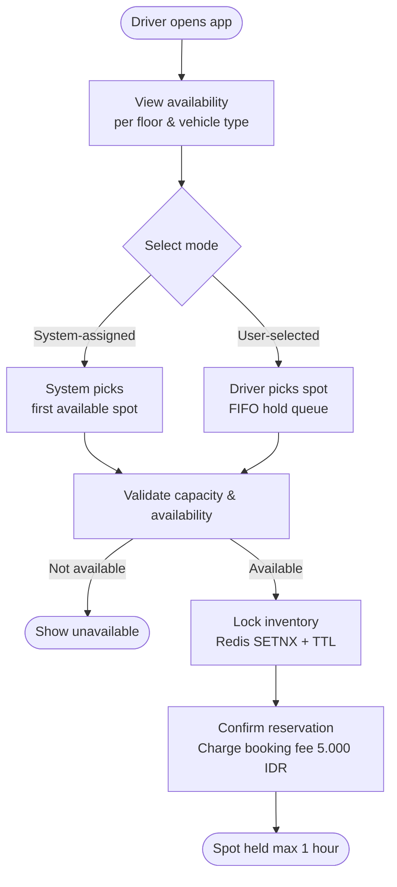

### 2. Check-in & Penalty Flow

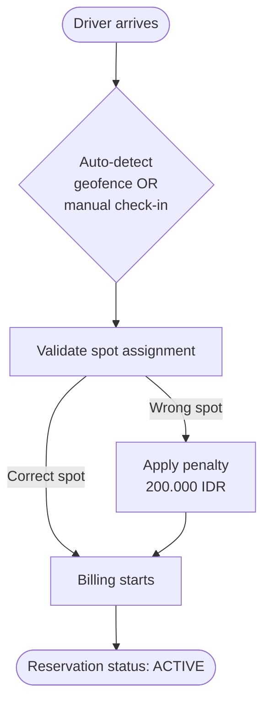

### 3. Billing & Checkout Flow

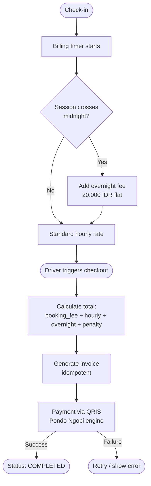

### 4. Cancellation & No-show Flow


### Pricing Rules Summary

| Condition | Fee |
|---|---|
| Booking fee (on confirm) | 5.000 IDR |
| First hour | 5.000 IDR |
| Each subsequent started hour | 5.000 IDR |
| Overnight (crosses midnight) | 20.000 IDR flat |
| Wrong spot penalty | 200.000 IDR |
| Cancel ≤ 2 min | 0 IDR |
| Cancel > 2 min (before check-in) | 5.000 IDR |
| No-show (> 1 hour) | 10.000 IDR |
| Overstay | No penalty, standard rate applies |

---

## High Level Design (HLD)

### System Architecture

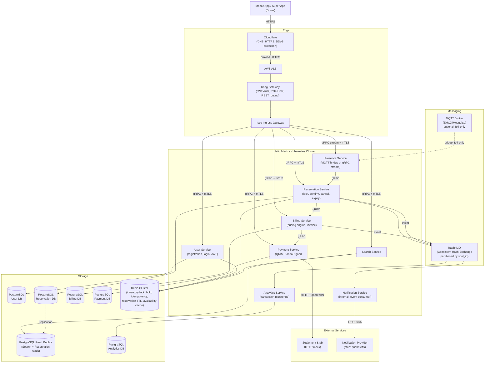

### Microservices Responsibilities

| Service | Responsibility |
|---|---|
| **Kong Gateway** | JWT auth, rate limiting, REST routing, plugin ecosystem |
| **User** | Driver registration, login, JWT issuance, profile management |
| **Search** | Query spot availability per floor & vehicle type, Redis cache + PostgreSQL read replica |
| **Reservation** | Create/cancel/hold reservation, Redis inventory lock, expiry TTL, idempotency, RabbitMQ enqueue, read replica for reads |
| **Billing** | Pricing engine via gorules (JDM), invoice generation, overnight/penalty calculation, own DB |
| **Payment** | QRIS integration via Pondo Ngopi, idempotent checkout, settlement check (stub), gobreaker, own DB |
| **Presence** | MQTT bridge (IoT) or gRPC bidirectional stream (software agent), geofence check-in/out |
| **Notification** | Internal event consumer (RabbitMQ), forwards to external Notification Provider stub via HTTP |
| **Analytics** | Consume events from RabbitMQ, store transaction metrics for business monitoring |

### Parking Inventory Structure

```
5 Floors x (30 cars + 50 motorcycles)
= 150 cars total + 250 motorcycles total

Spot ID: {FLOOR}-{TYPE}-{NUMBER}
Example: 1-CAR-01 | 3-MOTO-25

Spot Status: AVAILABLE -> LOCKED (hold, 60s) -> RESERVED -> OCCUPIED -> AVAILABLE

Assignment Modes:
- System-assigned : sistem pick spot pertama available, langsung lock
- User-selected   : driver pilih spot, hold 60s via Redis SETNX, lalu confirm
```

### Key Technical Decisions

| Concern | Solution |
|---|---|
| Double-booking prevention | Redis `SETNX` distributed lock per spot + TTL |
| Reservation expiry | Redis key TTL + background expiry worker |
| Idempotency | Idempotency key in gRPC metadata, stored in Redis |
| Database per service | Each service owns its own PostgreSQL DB — no shared tables across services |
| Read replica | Search Service + Reservation Service read from PostgreSQL read replica |
| Driver auth | License plate + vehicle type (+ optional phone number), JWT issued by Kong Gateway |
| Service-to-service auth | mTLS via Istio PeerAuthentication (STRICT mode) |
| API Gateway | Kong (JWT auth, rate limiting, REST routing) |
| Presence streaming | MQTT (IoT sensor) or gRPC bidirectional stream (software agent) |
| Circuit breaker | Istio `outlierDetection` + `sony/gobreaker` on Payment & Notification (non-core) |
| Retry & timeout | Istio VirtualService retry policy + per-service gRPC deadline |
| gRPC load balancing | Istio sidecar L7 LB with `LEAST_CONN` |
| War booking serialization | RabbitMQ Consistent Hash Exchange partitioned by `spot_id` |
| Pricing engine | gorules (JDM rules engine), rules stored in PostgreSQL, hot-reload via polling |
| Observability | Structured logging (zerolog), tracing (OpenTelemetry), metrics (Prometheus) — for infra/app monitoring |
| Analytics | Analytics Service consumes RabbitMQ events — for business/transaction monitoring |

---

## Scalability & Concurrency Design

### Problem: gRPC + High Concurrent Booking (War Booking)

All drivers booking at the same time (e.g. morning rush) creates two problems:

1. **gRPC + L4 LB** — HTTP/2 multiplexing causes all requests from one client to stick to one pod. Other pods sit idle.
2. **Redis lock contention** — 100 requests hitting `SETNX` for the same spot simultaneously causes retry storms.

### Solution 1: Istio L7 Load Balancing for gRPC

Istio sidecar proxy understands HTTP/2 at the request level, not connection level — enabling true per-request load balancing.

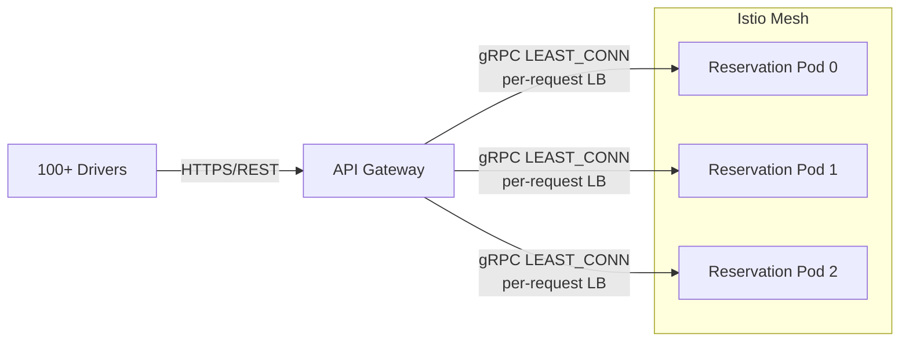

`LEAST_CONN` is preferred over `ROUND_ROBIN` because gRPC request durations vary — booking takes longer than availability check.

### Solution 2: RabbitMQ Consistent Hash Exchange for War Booking

Booking requests are enqueued and routed by `spot_id` hash — ensuring all requests for the same spot are processed **serially** by the same worker, eliminating race conditions.


RabbitMQ exchange config:

```json
{
  "exchange": "booking.exchange",
  "type": "x-consistent-hash",
  "routing_key": "{spot_id}",
  "queues": 10
}
```

### Solution 3: Read/Write Separation

| Operation | Path |
|---|---|
| Availability check (read) | Redis cache (TTL 5–10s), no lock needed |
| Booking (write) | RabbitMQ queue → serial consumer → Redis SETNX → DB |

### Full Concurrency Architecture

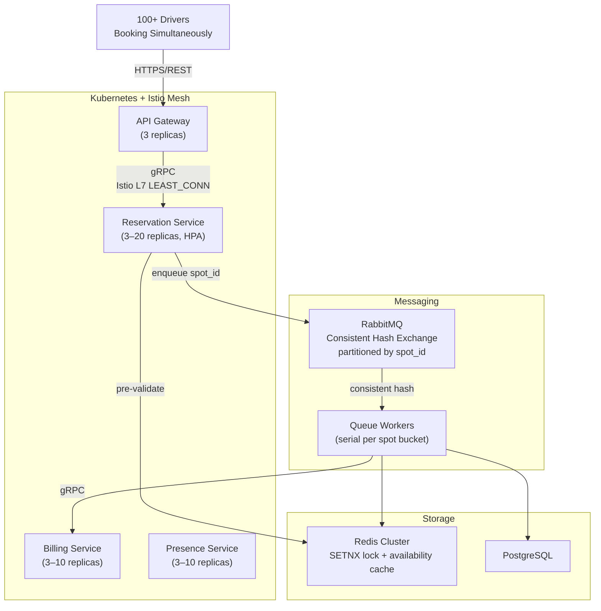

---

## Kubernetes Deployment

### Istio Setup

```bash
istioctl install --set profile=default -y
kubectl label namespace parkir-pintar istio-injection=enabled
```

### Reservation Service — Deployment & Service

```yaml
apiVersion: apps/v1
kind: Deployment
metadata:
  name: reservation-service
  namespace: parkir-pintar
spec:
  replicas: 3
  selector:
    matchLabels:
      app: reservation-service
  template:
    metadata:
      labels:
        app: reservation-service
        version: v1
    spec:
      containers:
        - name: reservation-service
          image: parkir-pintar/reservation-service:latest
          ports:
            - containerPort: 50051
              name: grpc
          resources:
            requests:
              cpu: 100m
              memory: 128Mi
            limits:
              cpu: 500m
              memory: 256Mi
---
apiVersion: v1
kind: Service
metadata:
  name: reservation-service
  namespace: parkir-pintar
spec:
  selector:
    app: reservation-service
  ports:
    - port: 50051
      targetPort: 50051
      name: grpc        # must be named "grpc" for Istio HTTP/2 detection
  type: ClusterIP
```

### Istio VirtualService + DestinationRule

```yaml
apiVersion: networking.istio.io/v1alpha3
kind: VirtualService
metadata:
  name: reservation-service
  namespace: parkir-pintar
spec:
  hosts:
    - reservation-service
  http:
    - timeout: 5s
      retries:
        attempts: 3
        perTryTimeout: 2s
        retryOn: unavailable,reset
      route:
        - destination:
            host: reservation-service
            port:
              number: 50051
---
apiVersion: networking.istio.io/v1alpha3
kind: DestinationRule
metadata:
  name: reservation-service
  namespace: parkir-pintar
spec:
  host: reservation-service
  trafficPolicy:
    loadBalancer:
      simple: LEAST_CONN
    connectionPool:
      http:
        http2MaxRequests: 1000
        maxRequestsPerConnection: 100
    outlierDetection:               # circuit breaker
      consecutive5xxErrors: 5
      interval: 10s
      baseEjectionTime: 30s
```

### HPA — Horizontal Pod Autoscaler

```yaml
apiVersion: autoscaling/v2
kind: HorizontalPodAutoscaler
metadata:
  name: reservation-service
  namespace: parkir-pintar
spec:
  scaleTargetRef:
    apiVersion: apps/v1
    kind: Deployment
    name: reservation-service
  minReplicas: 3
  maxReplicas: 20
  metrics:
    - type: Resource
      resource:
        name: cpu
        target:
          type: Utilization
          averageUtilization: 60
    - type: Pods
      pods:
        metric:
          name: grpc_server_handled_total
        target:
          type: AverageValue
          averageValue: 500
```

### mTLS — Istio PeerAuthentication

```yaml
apiVersion: security.istio.io/v1beta1
kind: PeerAuthentication
metadata:
  name: default
  namespace: parkir-pintar
spec:
  mtls:
    mode: STRICT    # all service-to-service must use mTLS, zero-code change needed
```

---

## Istio Service Mesh — Traffic Flow

Istio mesh covers **all intra-cluster communication**, including from Kong Gateway to downstream services. Every pod gets an Envoy sidecar injected automatically — so mTLS, L7 LB, retries, and circuit breaker apply uniformly with zero code changes.

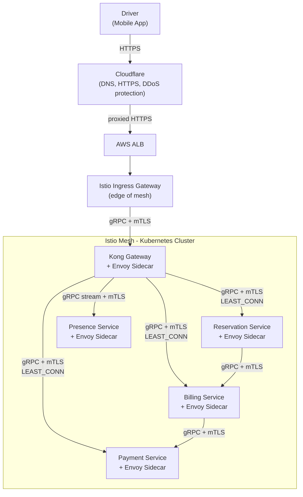

Key points:
- **Driver -> Cloudflare**: DNS resolution + HTTPS termination + DDoS protection
- **Cloudflare -> ALB**: proxied HTTPS, origin IP hidden
- **ALB -> Istio Ingress Gateway**: entry into mesh
- **All intra-mesh traffic**: gRPC + mTLS enforced by Istio `PeerAuthentication STRICT`
- **Kong Gateway** is a mesh member — its outbound calls go through Envoy sidecar, getting L7 LB + circuit breaker automatically

---

## Circuit Breaker Strategy

Circuit breaker can be applied at two levels. Both are used in this system for different purposes.

### Level 1: Istio `outlierDetection` (Mesh Level)

Configured in `DestinationRule`, Istio ejects unhealthy pods from the load balancing pool automatically.

```yaml
outlierDetection:
  consecutive5xxErrors: 5   # eject pod after 5 consecutive 5xx
  interval: 10s             # evaluation window
  baseEjectionTime: 30s     # how long pod stays ejected
```

| | Detail |
|---|---|
| **Pros** | Zero-code change; consistent across all services; integrated with Istio metrics & tracing; centralized config |
| **Cons** | Only detects HTTP 5xx — blind to business-level errors (e.g. payment returns 200 but body says failed); not portable without Istio |

### Level 2: `sony/gobreaker` (Code Level)

Applied in Go code specifically for **Payment** and **Notification** services — non-core services where business-level failure needs custom trip logic.

```go
cb := gobreaker.NewCircuitBreaker(gobreaker.Settings{
    MaxRequests: 3,
    Interval:    10 * time.Second,
    Timeout:     30 * time.Second,
    ReadyToTrip: func(counts gobreaker.Counts) bool {
        // trip on business error, not just HTTP 5xx
        return counts.ConsecutiveFailures > 5
    },
})
```

| | Detail |
|---|---|
| **Pros** | Custom trip logic based on business errors; portable without Istio; handles cases like payment gateway returning 200 with error body |
| **Cons** | State is per-pod — 10 replicas = 10 independent circuit breaker states, no shared state across pods; must be implemented manually per service |

### Why Both?

| Layer | Tool | Responsibility |
|---|---|---|
| Mesh (infra) | Istio `outlierDetection` | First line — eject bad pods based on 5xx, applies to all services automatically |
| Code (business) | `sony/gobreaker` | Second line — trip based on business logic errors, only on Payment Service (HTTP call to settlement stub) & Notification (non-core) |

Istio handles **infrastructure-level failures** (pod crash, network error, 5xx). `gobreaker` handles **business-level failures** (payment gateway returns 200 but transaction failed, notification service degraded). Together they cover both failure dimensions without overlap.

---

## Pricing Engine: gorules (JDM)

Pricing rules are managed via [gorules](https://github.com/gorules/gorules) — a JDM-based rules engine for Go. Rules are stored in PostgreSQL and hot-reloaded by Billing Service without requiring a redeploy.

### Why gorules

| Concern | Solution |
|---|---|
| Rules change without redeploy | Hot-reload via polling DB every 30s |
| Non-engineer readable | Rules defined in JSON (JDM format) |
| Deterministic & testable | Pure input/output evaluation, no side effects |
| Decoupled from code | Rules stored in DB, not hardcoded |

### Hot-reload Flow

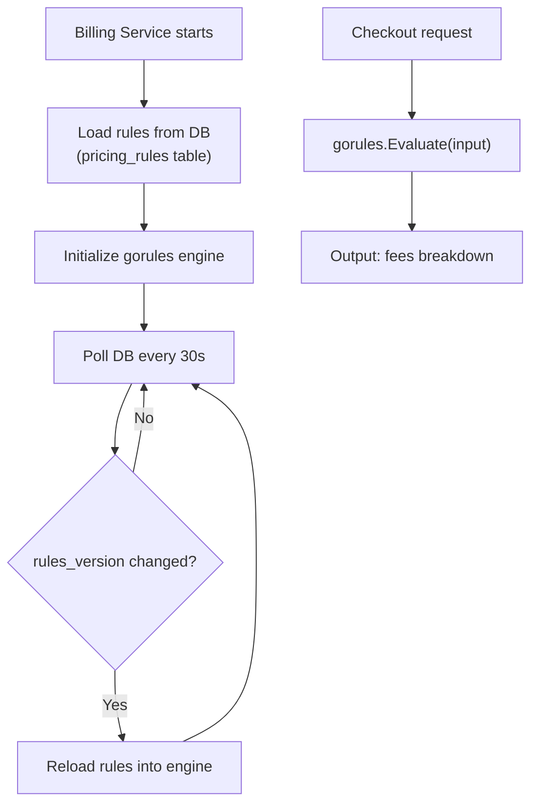

### Rules DB Schema

```sql
CREATE TABLE pricing_rules (
    id          UUID PRIMARY KEY DEFAULT gen_random_uuid(),
    version     INT NOT NULL,
    name        VARCHAR(100) NOT NULL,
    content     JSONB NOT NULL,   -- JDM rule graph
    is_active   BOOLEAN DEFAULT true,
    created_at  TIMESTAMP DEFAULT now()
);
```

### JDM Rule — Pricing Input/Output

Input ke gorules engine:

```json
{
  "duration_hours": 3,
  "crosses_midnight": true,
  "wrong_spot": false,
  "cancel_elapsed_minutes": 0,
  "is_noshow": false
}
```

Output dari gorules engine:

```json
{
  "booking_fee": 5000,
  "hourly_fee": 15000,
  "overnight_fee": 20000,
  "penalty": 0,
  "cancellation_fee": 0,
  "total": 40000
}
```

### Pricing Rules Summary (sebagai JDM nodes)

| Rule | Condition | Output |
|---|---|---|
| Booking fee | always on confirm | 5.000 IDR |
| Hourly fee | `ceil(duration_hours) * 5000` | variable |
| Overnight fee | `crosses_midnight == true` | 20.000 IDR flat |
| Wrong spot penalty | `wrong_spot == true` | 200.000 IDR |
| Cancel free | `cancel_elapsed_minutes <= 2` | 0 IDR |
| Cancel fee | `cancel_elapsed_minutes > 2` | 5.000 IDR |
| No-show fee | `is_noshow == true` | 10.000 IDR |
| Overstay | no condition | standard hourly rate applies |

### Billing Service — gorules Integration

```go
// load rules from DB
ruleContent, _ := db.GetActiveRule(ctx)
engine, _ := gorules.NewEngine(ruleContent)

// evaluate on checkout
result, _ := engine.Evaluate("pricing", map[string]any{
    "duration_hours":          3,
    "crosses_midnight":        true,
    "wrong_spot":              false,
    "cancel_elapsed_minutes":  0,
    "is_noshow":               false,
})

// hot-reload goroutine
go func() {
    for range time.Tick(30 * time.Second) {
        latest, _ := db.GetActiveRule(ctx)
        if latest.Version != current.Version {
            engine.Reload(latest.Content)
            current = latest
        }
    }
}()
```

---

## API Gateway: Kong

Kong sits in front of the Istio mesh as the application-level gateway. It handles driver-facing concerns before traffic enters the mesh.

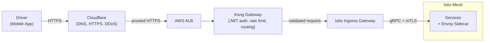

Kong is deployed as a pod inside the cluster — it also gets Istio sidecar injected, so its outbound calls to services are covered by mTLS and L7 LB automatically.

| Kong Responsibility | Detail |
|---|---|
| JWT validation | Verify driver JWT (issued after license plate + vehicle type auth) before request reaches any service |
| Rate limiting | Per-driver request throttle to prevent abuse |
| Routing | Map REST endpoints to upstream gRPC services |
| Plugin ecosystem | Auth, logging, CORS, request transformation via Kong plugins |

---

## Presence Service: Sensor to Service Streaming

Presence Service detects whether a vehicle is parked in the correct reserved spot. Two implementation options are provided depending on the sensor type confirmed by the product owner.

### Option A: MQTT (IoT Hardware Sensor)

Best for embedded/IoT devices (ESP32, Raspberry Pi, ultrasonic sensor) that cannot run HTTP/2.

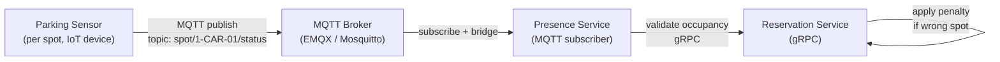

MQTT topic structure:
```
spot/{spot_id}/status   → { occupied: true, vehicle_detected: true }
spot/{spot_id}/checkin  → { reservation_id, timestamp }
```

| | Detail |
|---|---|
| **Pros** | Lightweight, low power, battle-tested for IoT; QoS levels (at-least-once, exactly-once); wide hardware support |
| **Cons** | Requires MQTT broker as additional component; needs bridge layer to translate MQTT events to gRPC calls |

### Option B: gRPC Bidirectional Streaming (Software Agent / Mobile)

Best for software-based sensor agents or mobile app presence detection (geofence).

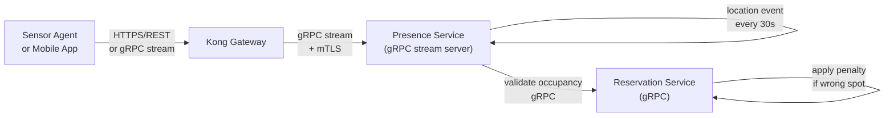

| | Detail |
|---|---|
| **Pros** | No extra broker needed; consistent with existing gRPC stack; built-in flow control and backpressure |
| **Cons** | Requires HTTP/2 support on the client side; not suitable for low-power embedded hardware |

### Comparison

| | Option A: MQTT | Option B: gRPC Stream |
|---|---|---|
| **Best for** | IoT hardware sensor (ESP32, RPi) | Software agent / mobile app |
| **Protocol** | MQTT over TCP | gRPC over HTTP/2 |
| **Extra component** | MQTT Broker (EMQX/Mosquitto) | None |
| **Hardware requirement** | Very low | HTTP/2 capable |
| **QoS / delivery guarantee** | Built-in (QoS 0/1/2) | gRPC deadline + retry |
| **Integration complexity** | Medium (broker + bridge) | Low (direct gRPC) |

> **Pending confirmation from Product Owner**: sensor type determines which option to implement. Both options converge at Presence Service internally — downstream gRPC calls to Reservation Service remain the same regardless of which option is chosen.

---

## Low Level Design (LLD)

### 1a. Reservation Flow — System-assigned Mode

Driver tidak memilih spot. Sistem langsung assign spot pertama yang tersedia sesuai vehicle type. Paling cepat karena tidak ada antrian hold.

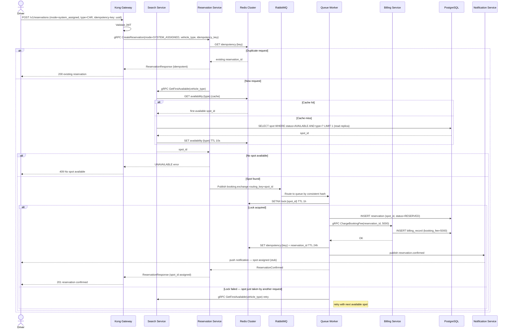

### 1b. Reservation Flow — User-selected Mode

Driver memilih spot spesifik. Ada mekanisme FIFO hold sementara saat driver sedang di halaman pilih spot, untuk mencegah konflik antar driver yang memilih spot yang sama.

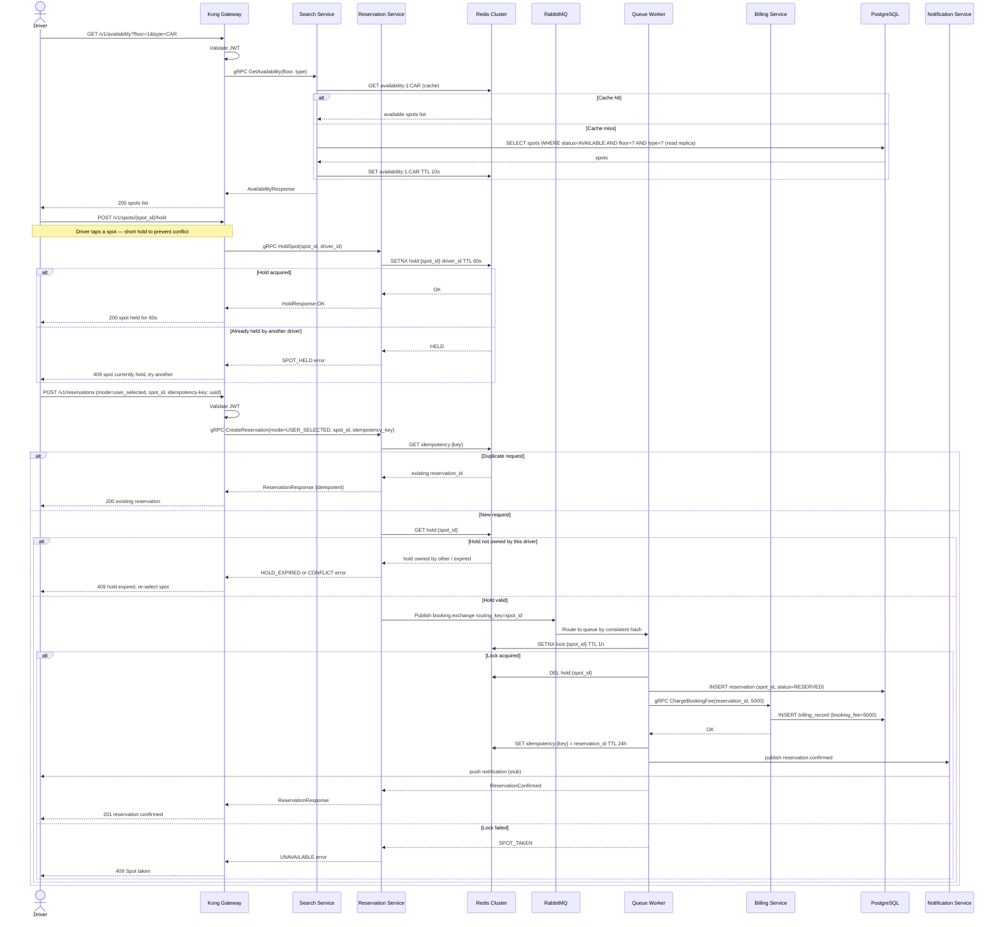

### Spot Assignment Mode — Redis Key Difference

| Mode | Redis Key saat Hold | Redis Key saat Confirmed |
|---|---|---|
| System-assigned | tidak ada hold key | `lock:{spot_id}` TTL 1h |
| User-selected | `hold:{spot_id}` TTL 60s | `lock:{spot_id}` TTL 1h, `hold` di-DEL |

### 2. Check-in & Penalty Flow — Sequence Diagram

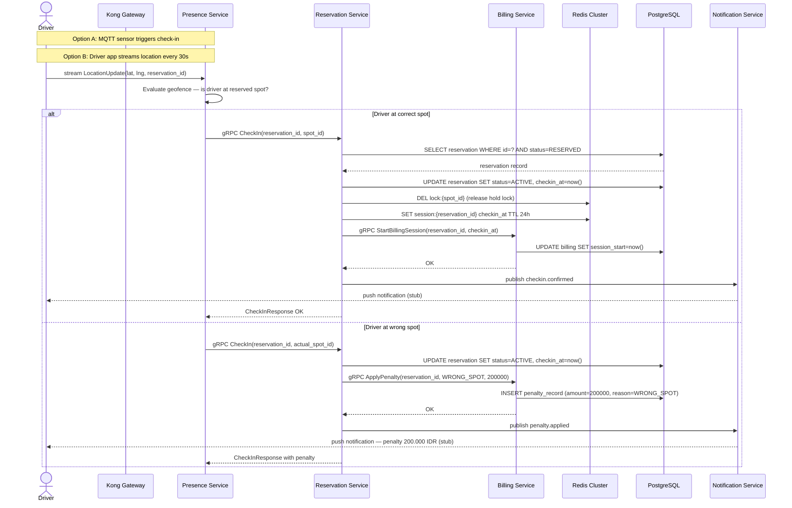

### 3. Billing & Checkout Flow — Sequence Diagram

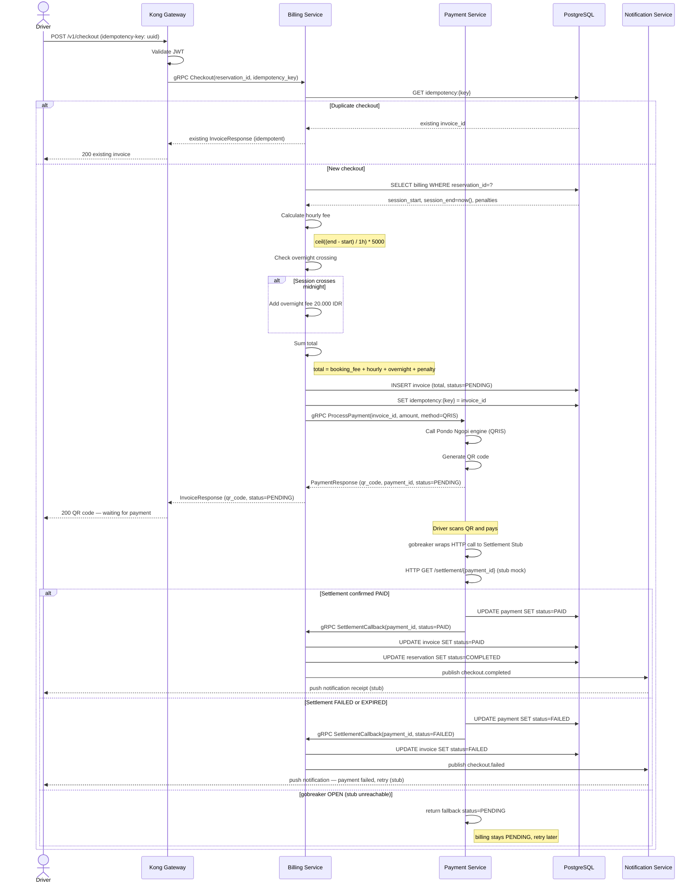

### 4. Cancellation Flow — Sequence Diagram

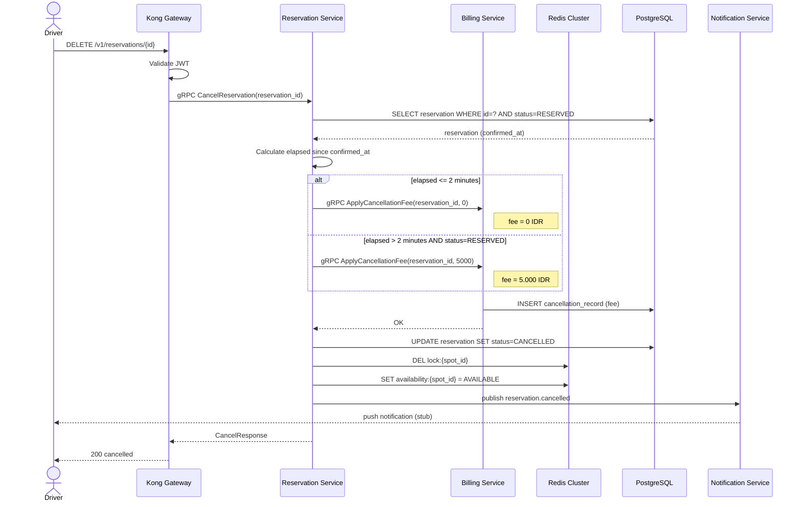

### 5. Reservation Expiry (No-show) — Sequence Diagram

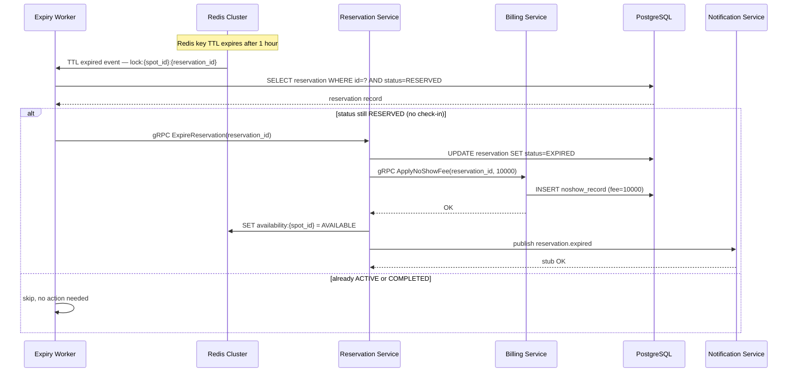

### 6. gRPC Service Contracts

```
UserService
  rpc Register(RegisterRequest) returns (RegisterResponse)
  rpc Login(LoginRequest) returns (LoginResponse)
  rpc ValidateToken(ValidateTokenRequest) returns (ValidateTokenResponse)
  rpc GetProfile(GetProfileRequest) returns (ProfileResponse)
  rpc UpdateProfile(UpdateProfileRequest) returns (ProfileResponse)

SearchService
  rpc GetAvailability(AvailabilityRequest) returns (AvailabilityResponse)

ReservationService
  rpc CreateReservation(CreateReservationRequest) returns (ReservationResponse)
  rpc CancelReservation(CancelReservationRequest) returns (CancelResponse)
  rpc CheckIn(CheckInRequest) returns (CheckInResponse)
  rpc ExpireReservation(ExpireRequest) returns (ExpireResponse)

BillingService
  rpc StartBillingSession(StartSessionRequest) returns (SessionResponse)
  rpc ChargeBookingFee(ChargeRequest) returns (ChargeResponse)
  rpc ApplyPenalty(PenaltyRequest) returns (PenaltyResponse)
  rpc ApplyCancellationFee(CancellationFeeRequest) returns (FeeResponse)
  rpc ApplyNoShowFee(NoShowFeeRequest) returns (FeeResponse)
  rpc Checkout(CheckoutRequest) returns (InvoiceResponse)

PaymentService
  rpc ProcessPayment(PaymentRequest) returns (PaymentResponse)
  rpc CheckSettlement(SettlementRequest) returns (SettlementResponse)  // stub mock, called via HTTP with gobreaker on Payment Service side

PresenceService
  rpc StreamLocation(stream LocationUpdate) returns (stream PresenceEvent)
```

### 7. Redis Key Schema

| Key Pattern | Value | TTL | Purpose |
|---|---|---|---|
| `lock:{spot_id}` | `reservation_id` | 1 hour | Inventory lock per spot |
| `availability:{spot_id}` | `AVAILABLE/LOCKED` | 10s | Read cache for availability |
| `idempotency:{key}` | `reservation_id / invoice_id` | 24h | Idempotency dedup |
| `session:{reservation_id}` | `checkin_at` | 24h | Active session tracker |
| `refresh_token:{driver_id}` | `refresh_token` | 7d | Refresh token store (User Service) |
| `blacklist:{jti}` | `1` | until exp | Revoked JWT blacklist (logout) |

### 8. Component Diagram

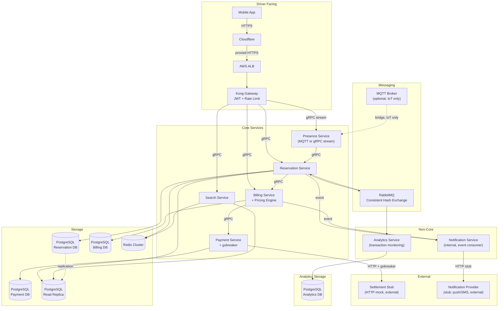

---

## User Service

User Service bertanggung jawab atas **registrasi driver**, **login**, **JWT issuance**, dan **profile management**. Kong Gateway mendelegasikan validasi token ke User Service via gRPC sebelum request diteruskan ke service lain.

### Responsibilities

| Fungsi | Detail |
|---|---|
| Registration | Driver daftar dengan license plate + vehicle type + password (+ optional phone number) |
| Login | Verifikasi credentials → issue JWT access token (1h) + refresh token (7d) |
| Token validation | Kong Gateway call `ValidateToken` gRPC sebelum forward request |
| Logout | Blacklist JWT `jti` di Redis sampai token expired |
| Refresh token | Issue access token baru dari refresh token yang valid |
| Profile | Get/update driver profile |

### Auth Flow

```mermaid
sequenceDiagram
    actor Driver
    participant Kong as Kong Gateway
    participant User as User Service
    participant Redis as Redis Cluster
    participant DB as PostgreSQL (User DB)

    Driver->>Kong: POST /v1/auth/register
    Kong->>User: gRPC Register(license_plate, vehicle_type, password)
    User->>DB: INSERT drivers (hashed_password)
    DB-->>User: driver_id
    User-->>Kong: RegisterResponse (driver_id)
    Kong-->>Driver: 201 registered

    Driver->>Kong: POST /v1/auth/login
    Kong->>User: gRPC Login(license_plate, vehicle_type, password)
    User->>DB: SELECT driver WHERE license_plate=? AND vehicle_type=?
    DB-->>User: driver record
    User->>User: bcrypt.Compare(password, hashed_password)
    alt Valid credentials
        User->>User: Sign JWT (sub=driver_id, exp=1h, jti=uuid)
        User->>Redis: SET refresh_token:{driver_id} TTL 7d
        User-->>Kong: LoginResponse (access_token, refresh_token)
        Kong-->>Driver: 200 JWT issued
    else Invalid credentials
        User-->>Kong: UNAUTHENTICATED error
        Kong-->>Driver: 401 invalid credentials
    end

    Driver->>Kong: POST /v1/reservations (Authorization: Bearer <jwt>)
    Kong->>User: gRPC ValidateToken(token)
    User->>User: Verify JWT signature + exp
    User->>Redis: GET blacklist:{jti}
    alt Token valid & not blacklisted
        User-->>Kong: ValidateResponse (driver_id, valid=true)
        Kong->>Kong: Inject driver_id ke request header
        Kong-->>Kong: Forward to Reservation Service
    else Token invalid or blacklisted
        User-->>Kong: UNAUTHENTICATED
        Kong-->>Driver: 401 Unauthorized
    end

    Driver->>Kong: POST /v1/auth/logout
    Kong->>User: gRPC Logout(token)
    User->>Redis: SET blacklist:{jti} TTL until_exp
    User->>Redis: DEL refresh_token:{driver_id}
    User-->>Kong: LogoutResponse OK
    Kong-->>Driver: 200 logged out
```

### Key Technical Decisions — User Service

| Concern | Solution |
|---|---|
| Password storage | `bcrypt` dengan cost factor 12 |
| Access token | JWT HS256, exp 1 hour, claim: `sub` (driver_id), `jti` (uuid) |
| Refresh token | Opaque token, stored in Redis TTL 7d, rotated on use |
| Logout / revocation | Blacklist `jti` di Redis sampai token expired — stateless JWT tetap bisa di-revoke |
| Token validation | Kong call `ValidateToken` gRPC per request — User Service sebagai auth authority |
| Driver identity | `license_plate + vehicle_type` sebagai unique identifier, bukan email |

### User DB — ERD

```mermaid
erDiagram
    drivers {
        uuid id PK
        varchar license_plate
        varchar vehicle_type "CAR / MOTORCYCLE"
        varchar hashed_password
        varchar phone_number "nullable"
        varchar full_name "nullable"
        boolean is_active
        timestamp created_at
        timestamp updated_at
    }

    refresh_tokens {
        uuid id PK
        uuid driver_id FK
        varchar token_hash
        timestamp expires_at
        timestamp created_at
    }

    drivers ||--o{ refresh_tokens : "has"
```

> `drivers` table di User DB adalah **source of truth** untuk identity. `drivers` table di Reservation DB hanya menyimpan `driver_id` sebagai reference — tidak ada FK lintas service.

---

## Entity Relationship Diagram (ERD)

Setiap service punya database sendiri. Tidak ada foreign key lintas service — relasi antar service hanya lewat event (RabbitMQ) atau gRPC call.

### User DB

```mermaid
erDiagram
    drivers {
        uuid id PK
        varchar license_plate
        varchar vehicle_type "CAR / MOTORCYCLE"
        varchar hashed_password
        varchar phone_number "nullable"
        varchar full_name "nullable"
        boolean is_active
        timestamp created_at
        timestamp updated_at
    }

    refresh_tokens {
        uuid id PK
        uuid driver_id FK
        varchar token_hash
        timestamp expires_at
        timestamp created_at
    }

    drivers ||--o{ refresh_tokens : "has"
```

### Reservation DB

```mermaid
erDiagram
    drivers {
        uuid id PK
        varchar license_plate
        varchar vehicle_type
        varchar phone_number "nullable"
        timestamp created_at
    }

    parking_spots {
        uuid id PK
        varchar spot_id "e.g. 1-CAR-01"
        int floor
        varchar vehicle_type "CAR / MOTORCYCLE"
        varchar status "AVAILABLE / LOCKED / RESERVED / OCCUPIED"
        timestamp updated_at
    }

    reservations {
        uuid id PK
        uuid driver_id FK
        uuid spot_id FK
        varchar mode "SYSTEM_ASSIGNED / USER_SELECTED"
        varchar status "RESERVED / ACTIVE / COMPLETED / CANCELLED / EXPIRED"
        timestamp confirmed_at
        timestamp checkin_at "nullable"
        timestamp checkout_at "nullable"
        timestamp expires_at
        varchar idempotency_key
        timestamp created_at
    }

    drivers ||--o{ reservations : "makes"
    parking_spots ||--o{ reservations : "assigned to"
```

### Billing DB

```mermaid
erDiagram
    billing_sessions {
        uuid id PK
        uuid reservation_id "ref to Reservation DB (no FK)"
        timestamp session_start
        timestamp session_end "nullable"
        int booking_fee
        int hourly_fee
        int overnight_fee
        int penalty
        int cancellation_fee
        int noshow_fee
        int total
        varchar status "PENDING / PAID / FAILED"
        timestamp created_at
    }

    penalty_records {
        uuid id PK
        uuid billing_session_id FK
        varchar reason "WRONG_SPOT"
        int amount
        timestamp created_at
    }

    cancellation_records {
        uuid id PK
        uuid billing_session_id FK
        int fee
        timestamp created_at
    }

    invoices {
        uuid id PK
        uuid billing_session_id FK
        int total
        varchar status "PENDING / PAID / FAILED"
        varchar idempotency_key
        timestamp created_at
    }

    pricing_rules {
        uuid id PK
        int version
        varchar name
        jsonb content "JDM rule graph"
        boolean is_active
        timestamp created_at
    }

    billing_sessions ||--o{ penalty_records : "has"
    billing_sessions ||--o{ cancellation_records : "has"
    billing_sessions ||--|| invoices : "generates"
```

### Payment DB

```mermaid
erDiagram
    payments {
        uuid id PK
        uuid invoice_id "ref to Billing DB (no FK)"
        varchar method "QRIS"
        int amount
        varchar status "PENDING / PAID / FAILED"
        varchar qr_code
        varchar idempotency_key
        timestamp created_at
        timestamp updated_at
    }

    settlement_logs {
        uuid id PK
        uuid payment_id FK
        varchar settlement_status "PAID / FAILED / EXPIRED"
        jsonb raw_response "stub response payload"
        timestamp checked_at
    }

    payments ||--o{ settlement_logs : "checked via"
```

### Analytics DB

```mermaid
erDiagram
    transaction_events {
        uuid id PK
        varchar event_type "reservation.confirmed / checkout.completed / penalty.applied / etc"
        uuid reservation_id "denormalized"
        uuid driver_id "denormalized"
        varchar spot_id "denormalized"
        varchar vehicle_type "denormalized"
        int amount "nullable"
        jsonb payload "full event payload"
        timestamp event_at
    }

    daily_summaries {
        uuid id PK
        date summary_date
        int total_reservations
        int total_completed
        int total_cancelled
        int total_expired
        int total_revenue
        int total_penalties
        int peak_hour "0-23"
        timestamp created_at
    }
```

### Cross-service Reference Summary

Karena database per service, tidak ada foreign key lintas DB. Referensi antar service dilakukan via ID yang di-pass lewat event atau gRPC:

| Field | Ada di Service | Merujuk ke |
|---|---|---|
| `billing_sessions.reservation_id` | Billing DB | Reservation DB |
| `payments.invoice_id` | Payment DB | Billing DB |
| `transaction_events.reservation_id` | Analytics DB | Reservation DB |
| `transaction_events.driver_id` | Analytics DB | Reservation DB |
| `reservations.driver_id` | Reservation DB | User DB (no FK) |

---

## Third-Party Libraries & Justification

### Framework Decision

Berdasarkan evaluasi antara Golang Native, Beego, dan GoFr:

| Kriteria | Beego | GoFr | Golang Native |
|---|---|---|---|
| Konfigurasi | Instan | Instan | Manual |
| Dokumentasi | Tidak selalu update | Lengkap | Lengkap (official) |
| Fleksibilitas | Terbatas | Terbatas | Penuh |
| Kompatibilitas protokol | HTTP only | HTTP + gRPC | HTTP, gRPC, WebSocket, MQTT |
| Performa (p95 latency) | 3.156ms | 6.58ms | **1.595ms** |
| Binary size | 18M | 43M | **11M** |
| Total Score | 27 | 27 | **32** |

**Keputusan: Golang Native** — karena sistem ini heavily gRPC (bukan REST CRUD biasa), butuh MQTT support untuk Presence Service, dan performa serta binary size paling optimal. Framework seperti GoFr/Beego justru menambah overhead tanpa benefit signifikan untuk usecase ini.

- **Gin** tetap dipakai di API Gateway layer untuk handle REST routing dari driver (driver-facing HTTP endpoint)
- Semua service-to-service: **gRPC native** via `google.golang.org/grpc`
- Presence Service (IoT option): **MQTT native** via `paho.mqtt.golang`

---

### Libraries from Recommended List

| # | Category | Library | Version | Justification |
|---|---|---|---|---|
| 1 | Web | [Gin](https://github.com/gin-gonic/gin) | 1.9.1 | Digunakan di API Gateway service untuk handle REST routing dari driver. Performant, middleware support (JWT, rate limit), dan familiar di ekosistem Go |
| 2 | Rest Client | Standard library (`net/http`) | - | Digunakan di Payment Service untuk HTTP call ke Settlement Stub dan di Notification Service untuk call ke Notification Provider. Cukup untuk simple HTTP client dengan gobreaker wrapper |
| 3 | Logging | [Zap](https://github.com/uber-go/zap) + [Lumberjack](https://github.com/natefinch/lumberjack) | 1.26.0 + 2.2.1 | Zap untuk structured logging (JSON format, zero-allocation). Lumberjack untuk log rotation. Dipakai di semua service |
| 4 | Configuration | [Godotenv](https://github.com/joho/godotenv) | 1.5.1 | Load environment variables dari `.env` file. Dipakai di semua service untuk config DB, Redis, RabbitMQ connection string |
| 5 | Monitoring | [Prometheus client](https://github.com/prometheus/client_golang) | 1.19.0 | Expose `/metrics` endpoint di setiap service. Dipakai bersama Grafana untuk infra/app monitoring |
| 6 | RDBMS | [SQLx](https://github.com/jmoiron/sqlx) | 1.3.5 | Wrapper di atas `database/sql` dengan support named queries dan struct scanning. Dipakai di Reservation, Billing, Payment, Analytics service |
| 7 | Key-value | [go-redis](https://github.com/redis/go-redis) | 9.4.0 | Client Redis untuk SETNX inventory lock, hold key, idempotency key, availability cache. Dipakai di Reservation dan Search service |
| 8 | Queue | [amqp091-go](https://github.com/rabbitmq/amqp091-go) | latest | Official RabbitMQ client untuk Go. Dipakai di Reservation Service (publish) dan Notification/Analytics Service (consume) |
| 9 | Scheduler | [GoCron](https://github.com/go-co-op/gocron) | 2.2.2 | Dipakai di Billing Service untuk polling gorules rules dari DB setiap 30 detik (hot-reload). Juga untuk expiry worker yang cek reservation TTL |
| 10 | Unit Test | [Testify](https://github.com/stretchr/testify) | 1.8.4 | Assert, mock, dan suite untuk unit test pricing engine, idempotency, overlap detection. Dipakai di semua service |
| 11 | Concurrency | Standard library (Goroutines) | - | Dipakai untuk hot-reload goroutine di Billing Service, background expiry worker, dan concurrent request handling |
| 12 | JSON | Standard library (`encoding/json`) | - | Parse/build JSON payload untuk event messages, gorules input/output, settlement stub response |
| 13 | Packaging | Go modules (`go mod`) | - | Dependency management untuk semua service |

### Libraries Outside Recommended List

| Category | Library | Version | Justification |
|---|---|---|---|
| gRPC | [google.golang.org/grpc](https://github.com/grpc/grpc-go) | 1.63.0 | Core requirement — semua service-to-service communication pakai gRPC over HTTP/2. Tidak ada di list tapi wajib ada |
| gRPC Protobuf | [google.golang.org/protobuf](https://github.com/protocolbuffers/protobuf-go) | 1.34.0 | Code generation dari `.proto` files untuk semua gRPC service contracts |
| JWT | [golang-jwt/jwt](https://github.com/golang-jwt/jwt) | 5.2.1 | Validasi JWT token di Kong Gateway dan auth interceptor. Driver auth by license plate + vehicle type |
| Circuit Breaker | [sony/gobreaker](https://github.com/sony/gobreaker) | 0.5.0 | Circuit breaker di Payment Service (HTTP call ke Settlement Stub) dan Notification Service (HTTP call ke Notification Provider) |
| Pricing Engine | [gorules/gorules](https://github.com/gorules/gorules) | latest | JDM-based rules engine untuk pricing calculation. Rules disimpan di DB, hot-reload tanpa redeploy |
| OpenTelemetry | [go.opentelemetry.io/otel](https://github.com/open-telemetry/opentelemetry-go) | 1.26.0 | Distributed tracing antar service. Trace context di-propagate via gRPC metadata |
| MQTT | [eclipse/paho.mqtt.golang](https://github.com/eclipse/paho.mqtt.golang) | 1.4.3 | MQTT client di Presence Service untuk subscribe ke MQTT Broker (Option A: IoT sensor). Conditional — hanya dipakai jika PO konfirmasi pakai IoT sensor |
| UUID | [google/uuid](https://github.com/google/uuid) | 1.6.0 | Generate UUID untuk reservation ID, invoice ID, idempotency key di semua service |
| DB Migration | [golang-migrate/migrate](https://github.com/golang-migrate/migrate) | 4.17.0 | Schema migration untuk semua PostgreSQL DB per service. Dijalankan saat service startup atau via CLI |
