# ParkirPintar — Smart Parking Marketplace

[](https://sonarcloud.io/summary/new_code?id=ParkirPintar_parkir-pintar-backend)

## Table of Contents

- [Overview](#overview)
- [Assumptions](#assumptions)
- [Project Structure](#project-structure)
- [Business Flow Logic](#business-flow-logic)
- [Pricing Rules Summary](#pricing-rules-summary)
- [High Level Design (HLD)](#high-level-design-hld)
- [Low Level Design (LLD)](#low-level-design-lld)
- [Entity Relationship Diagram (ERD)](#entity-relationship-diagram-erd)
- [Scalability & Concurrency Design](#scalability--concurrency-design)
- [Kubernetes Deployment](#kubernetes-deployment)
- [Istio Service Mesh](#istio-service-mesh--traffic-flow)
- [Circuit Breaker Strategy](#circuit-breaker-strategy)
- [Pricing Engine: gorules (JDM)](#pricing-engine-gorules-jdm)
- [API Gateway: Kong](#api-gateway-kong)
- [Presence Service](#presence-service-location-api--check-incheck-out)
- [API Documentation](#api-documentation-swagger)
- [E2E Testing](#e2e-testing-newman)
- [Third-Party Libraries & Justification](#third-party-libraries--justification)

---

## Overview

ParkirPintar adalah backend system untuk **Smart Parking Marketplace** yang mengelola satu area parkir terpusat (gedung parkir 5 lantai). Sistem ini mendukung Driver yang membutuhkan parkir dengan pendekatan **lite, simple, dan fast** — Driver klik reserve, sistem lock inventory, dan setelah konfirmasi Driver bisa langsung menuju spot yang di-assign.

Sistem ini dirancang sebagai **mini app di dalam super app** atau sebagai standalone service.

### Key Features

- **Single parking area** dengan centralized inventory (5 lantai × 30 mobil + 50 motor = **150 mobil, 250 motor**)
- **Dua mode assignment**: System-assigned (fastest, sistem langsung pilih spot) dan User-selected (driver pilih spot, dengan hold sementara)
- **Reservation hold**: Spot di-lock selama 1 jam setelah konfirmasi. Jika Driver tidak check-in dalam 1 jam setelah masuk gerbang parkir, reservasi expired otomatis
- **Wrong-spot blocking**: Driver **tidak bisa** parkir di spot yang berbeda dari yang di-reserve — sistem memblokir akses
- **Real-time billing**: Billing dimulai saat check-in, dihitung berdasarkan durasi aktual parkir
- **Payment before exit**: Driver harus bayar dulu (via QRIS/Pondo Ngopi) sebelum bisa keluar area parkir
- **Overnight fee**: Biaya tambahan flat 20.000 IDR setiap kali sesi melewati tengah malam (kumulatif per crossing)
- **Location tracking**: App mengirim location update setiap ≤30 detik via unary API call
- **Booking fee**: 5.000 IDR per reservasi sukses, dicharge saat konfirmasi (terpisah dari hitungan jam parkir)

---

## Assumptions

1. **Single parking area**: 5 lantai × 30 mobil + 50 motor = **150 mobil, 250 motor**
2. **Spot ID format**: `{FLOOR}-{TYPE}-{NUMBER}` contoh: `1-CAR-01`, `3-MOTO-25`
3. **Check-in** di-trigger oleh API call ke Presence Service. Presence Service yang memanggil Reservation.CheckIn dan **Billing.StartBillingSession**
4. **Check-out**: Driver harus bayar dulu baru bisa keluar (payment before exit)
5. **Wrong-spot**: Driver **diblokir** dari parkir di spot yang salah — bukan dikenakan penalty. Sistem tidak mengizinkan parkir di spot selain yang di-assign
6. **Overnight fee**: Biaya tambahan 20.000 IDR flat **setiap kali** sesi melewati tengah malam (00:00). Jika parkir 2 malam = 2 × 20.000 IDR. Setelah midnight crossing, hitungan jam normal berlanjut
7. **Booking fee** 5.000 IDR — driver **harus bayar via QRIS** setelah reservasi. Reservasi baru confirmed setelah payment success. Ini **di luar** hitungan jam parkir
8. **Konfirmasi reservasi** berasal dari sistem. Setelah masuk gerbang parkir, kendaraan harus berada di parking lot yang ditentukan dalam waktu 1 jam
9. **Parking lot ID** dikirim sebagai response API (bukan AR navigation)
10. **Pricing** dihitung dari durasi aktual sesi parkir, bukan fixed price di awal seperti kompetitor
11. **Overstay**: Tidak ada penalty overstay — waktu tambahan dihitung dengan tarif jam standar yang sama
12. **Notification service** adalah stub (tidak ada integrasi push/SMS nyata)
13. **Presence** menggunakan unary gRPC API (bukan stream), app hit API setiap ≤30 detik
14. **Driver identity**: Diidentifikasi menggunakan **driver_id** yang di-pass via request field
15. **mTLS** untuk service-to-service auth via Istio PeerAuthentication (STRICT mode)
16. **No JWT/auth service**: Sistem ini tidak memiliki User Service atau JWT authentication — autentikasi di-handle oleh super app yang mengintegrasikan ParkirPintar sebagai mini app
17. **Idempotency keys** di-pass via gRPC metadata headers
18. **Payment gateway**: Menggunakan engine Pondo Ngopi untuk QRIS payment

---

## Project Structure

Monorepo dengan struktur **Clean Architecture + Domain-Driven Design** per service.

```
.
├── .github/
│   └── workflows/
│       ├── ci-reservation.yml    # CI (auto on push/PR) + Build & Deploy (manual trigger)
│       ├── ci-billing.yml        # CI (auto on push/PR) + Build & Deploy (manual trigger)
│       ├── ci-payment.yml        # CI (auto on push/PR) + Build & Deploy (manual trigger)
│       ├── ci-search.yml         # CI (auto on push/PR) + Build & Deploy (manual trigger)
│       ├── ci-presence.yml       # CI (auto on push/PR) + Build & Deploy (manual trigger)
│       ├── ci-notification.yml   # CI (auto on push/PR) + Build & Deploy (manual trigger)
│       ├── ci-analytics.yml      # CI (auto on push/PR) + Build & Deploy (manual trigger)
│       ├── ci-db-migrate.yml     # DB migration via golang-migrate (auto on push to sre/migrations/)
│       └── ci-notification.yml   # CI (auto on push/PR) + Build & Deploy (manual trigger)
│
├── proto/                        # Shared protobuf definitions (gRPC contracts)
│   ├── billing/
│   ├── payment/
│   ├── presence/
│   ├── reservation/
│   └── search/
│
├── services/                     # Microservices — each is an independent Go module
│   ├── reservation/
│   │   ├── cmd/                  # main.go — entrypoint
│   │   ├── internal/
│   │   │   ├── handler/          # gRPC + HTTP handlers (transport layer)
│   │   │   ├── usecase/          # Business logic
│   │   │   ├── repository/       # DB + Redis access
│   │   │   ├── adapter/          # External service clients (gRPC, HTTP)
│   │   │   └── model/            # Domain models
│   │   ├── pkg/                  # Reusable utilities (idempotency, lock, etc.)
│   │   ├── configs/              # Config files / env defaults
│   │   ├── build/                # Dockerfile, CI config
│   │   ├── migrations/           # SQL migration files
│   │   ├── go.mod
│   │   └── go.sum
│   ├── billing/                  # Same structure as reservation
│   ├── payment/                  # Same structure as reservation
│   ├── search/                   # Same structure as reservation
│   ├── presence/                 # Same structure as reservation
│   ├── notification/             # Same structure as reservation
│   └── analytics/                # Same structure as reservation
│
├── sre/
│   ├── e2e/
│   │   ├── swagger.yaml                           # OpenAPI 3.0 spec (single source of truth)
│   │   ├── integration/                           # Go integration tests
│   │   ├── k6/                                    # Load testing scripts
│   │   ├── parkir-pintar.postman_environment.json # Postman environment variables
│   │   └── parkir-pintar.postman_collection.json  # Newman/Postman E2E test collection
│   ├── kubernetes/
│   │   ├── base/                 # Deployments, Services, ConfigMaps, HPA
│   │   ├── istio/                # VirtualService, DestinationRule, PeerAuthentication
│   │   └── monitoring/           # Monitoring stack configs
│   ├── observability/            # Prometheus, Grafana, Loki, Tempo, OTel Collector, Kiali
│   ├── stubs/                    # Settlement QRIS mock responses
│   ├── terraform/                # AWS infra (EKS, RDS, ElastiCache, MQ, VPC)
│   ├── docker-compose.yaml       # Local development stack
│   ├── init-db.sql               # Database initialization
│   └── README.md
│
├── go.work                       # Go workspace — links all service modules
└── README.md
```

### Per-Service Internal Structure (Clean Architecture)

```
services/{service}/
├── cmd/
│   └── main.go               # Entrypoint — wire dependencies, start gRPC server
├── internal/
│   ├── handler/              # Transport layer — gRPC + HTTP handlers, request/response mapping
│   ├── usecase/              # Business logic — pure, no framework dependency
│   ├── repository/           # Data access — PostgreSQL (pgx), Redis (go-redis)
│   ├── adapter/              # External service clients (gRPC clients, HTTP clients)
│   └── model/                # Domain models & DTOs
├── pkg/                      # Internal reusable utilities (idempotency, lock helper, etc.)
│   └── proto/                # Generated gRPC code (per service)
├── configs/                  # Default config, env schema
├── build/
│   └── Dockerfile
├── migrations/               # SQL migration files
└── go.mod
```

| Layer | Responsibility | Depends On |
|---|---|---|
| `handler` | Receive gRPC/HTTP request, call usecase, return response | `usecase` |
| `usecase` | Business rules, orchestration | `repository`, `adapter`, `model` |
| `repository` | DB/Redis queries, no business logic | `model` |
| `adapter` | External service clients (gRPC, HTTP) | external proto/contracts |
| `model` | Domain structs, no logic | nothing |

Business logic (`usecase`) tidak bergantung pada framework, DB driver, atau transport — sesuai prinsip Clean Architecture.

---

## Business Flow Logic

### 1. Reservation Flow

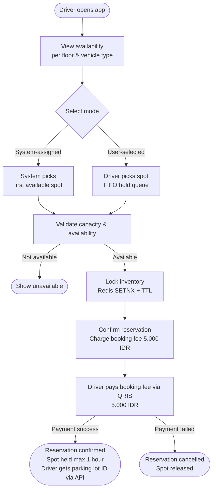
```mermaid
flowchart TD
    A([Driver opens app]) --> B[View availability\nper floor & vehicle type]
    B --> C{Select mode}
    C -->|System-assigned| D[System picks\nfirst available spot]
    C -->|User-selected| E[Driver picks spot\nFIFO hold queue]
    D --> F[Validate capacity & availability]
    E --> F
    F -->|Not available| G([Show unavailable])
    F -->|Available| H[Lock inventory\nRedis SETNX + TTL]
    H --> I[Confirm reservation\nCharge booking fee 5.000 IDR]
    I --> I2[Driver pays booking fee via QRIS\n5.000 IDR]
    I2 -->|Payment success| J([Reservation confirmed\nSpot held max 1 hour\nDriver gets parking lot ID via API])
    I2 -->|Payment failed| I3([Reservation cancelled\nSpot released])
```

### 2. Check-in Flow

Check-in di-trigger oleh **unary API call** ke Presence Service. Presence Service yang memanggil Reservation.CheckIn dan **Billing.StartBillingSession** untuk mulai menghitung waktu parkir.

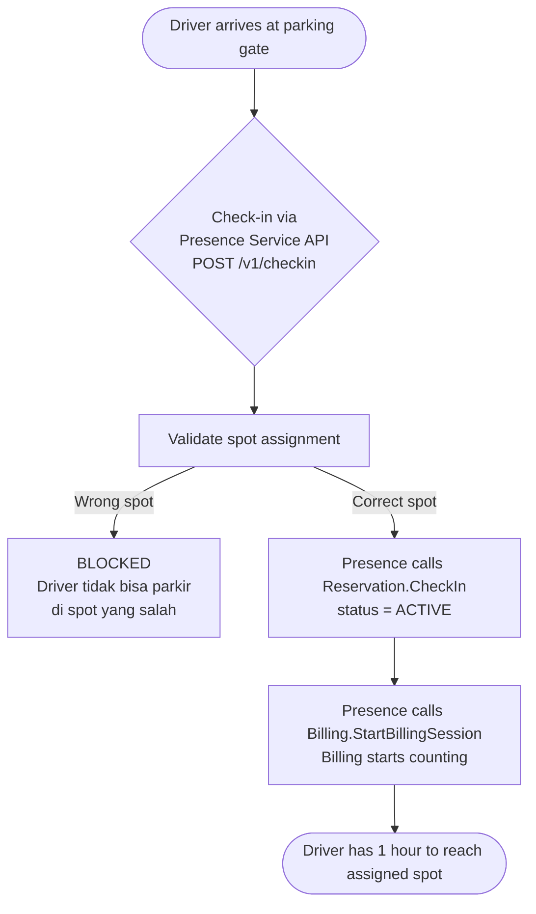
```mermaid
flowchart TD
    A([Driver arrives at parking gate]) --> B{Check-in via\nPresence Service API\nPOST /v1/checkin}
    B --> C[Validate spot assignment]
    C -->|Wrong spot| D[BLOCKED\nDriver tidak bisa parkir\ndi spot yang salah]
    C -->|Correct spot| E[Presence calls Reservation.CheckIn\nstatus = ACTIVE]
    E --> F[Presence calls Billing.StartBillingSession\nBilling starts counting]
    F --> G([Driver has 1 hour to reach assigned spot])
```

### 3. Billing & Checkout Flow

Billing dihitung dari durasi aktual sesi parkir. Driver **harus bayar dulu sebelum bisa keluar** area parkir.

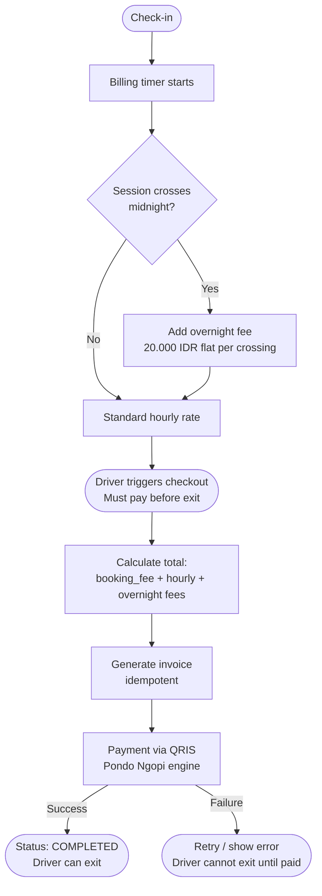
```mermaid
flowchart TD
    A([Check-in]) --> B[Billing timer starts]
    B --> C{Session crosses\nmidnight?}
    C -->|Yes| D[Add overnight fee\n20.000 IDR flat per crossing]
    C -->|No| E[Standard hourly rate]
    D --> E
    E --> F([Driver triggers checkout\nMust pay before exit])
    F --> G[Calculate total:\nbooking_fee + hourly + overnight fees]
    G --> H[Generate invoice\nidempotent]
    H --> I[Payment via QRIS\nPondo Ngopi engine]
    I -->|Success| J([Status: COMPLETED\nDriver can exit])
    I -->|Failure| K([Retry / show error\nDriver cannot exit until paid])
```

### 4. Cancellation & No-show Flow

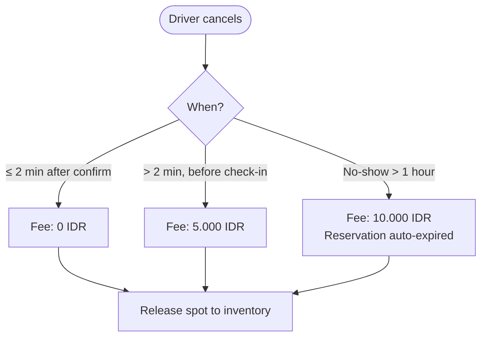
```mermaid
flowchart TD
    A([Driver cancels]) --> B{When?}
    B -->|≤ 2 min after confirm| C[Fee: 0 IDR]
    B -->|> 2 min, before check-in| D[Fee: 5.000 IDR]
    B -->|No-show > 1 hour| E[Fee: 10.000 IDR\nReservation auto-expired]
    C --> F[Release spot to inventory]
    D --> F
    E --> F
```

---

## Pricing Rules Summary

Tarif **tidak** ditentukan di awal seperti kompetitor yang lock fixed price untuk seluruh booking. Tarif dihitung dari durasi aktual sesi parkir, disesuaikan dengan reservation window dan aturan fee yang berlaku.

| Condition | Fee | Notes |
|---|---|---|
| Booking fee (on confirm) | 5.000 IDR | **Harus dibayar** via QRIS setelah reservasi. Reservasi baru confirmed setelah payment success |
| First hour | 5.000 IDR | Dihitung saat check-in |
| Each subsequent started hour | 5.000 IDR | Ceil — setiap jam yang dimulai dihitung penuh |
| Overnight (crosses midnight) | 20.000 IDR flat per crossing | Biaya tambahan per hari jika lewat tengah malam. 2 malam = 2 × 20.000 IDR |
| Wrong spot | **BLOCKED** | Driver tidak bisa parkir di spot yang salah — akses diblokir |
| Cancel ≤ 2 min | 0 IDR | Free cancellation |
| Cancel > 2 min (before check-in) | 5.000 IDR | |
| No-show (> 1 hour) | 10.000 IDR | Reservasi auto-expired |
| Overstay | No penalty | Tarif jam standar tetap berlaku, tidak ada penalty tambahan |

---

## High Level Design (HLD)

### System Architecture

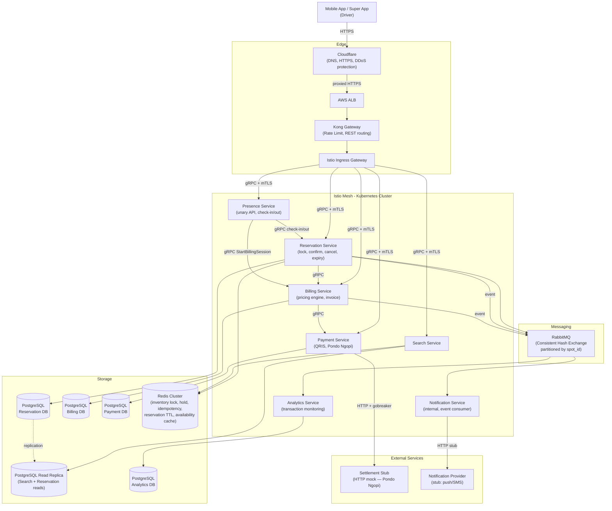
```mermaid
graph TD
    Client["Mobile App / Super App\n(Driver)"]

    subgraph Edge
        CF["Cloudflare\n(DNS, HTTPS, DDoS protection)"]
        ALB["AWS ALB"]
        KONG["Kong Gateway\n(Rate Limit, REST routing)"]
        IGW["Istio Ingress Gateway"]
    end

    subgraph Istio Mesh - Kubernetes Cluster
        SVC_SEARCH["Search Service"]
        SVC_RESERVATION["Reservation Service\n(lock, confirm, cancel, expiry)"]
        SVC_BILLING["Billing Service\n(pricing engine, invoice)"]
        SVC_PAYMENT["Payment Service\n(QRIS, Pondo Ngopi)"]
        SVC_PRESENCE["Presence Service\n(unary API, check-in/out)"]
        SVC_NOTIF["Notification Service\n(internal, event consumer)"]
        SVC_ANALYTICS["Analytics Service\n(transaction monitoring)"]
    end

    subgraph External Services
        EXT_SETTLEMENT["Settlement Stub\n(HTTP mock — Pondo Ngopi)"]
        EXT_NOTIF["Notification Provider\n(stub: push/SMS)"]
    end

    subgraph Storage
        PG_RESERVATION[("PostgreSQL\nReservation DB")]
        PG_BILLING[("PostgreSQL\nBilling DB")]
        PG_PAYMENT[("PostgreSQL\nPayment DB")]
        PG_REPLICA[("PostgreSQL Read Replica\n(Search + Reservation reads)")]
        REDIS[("Redis Cluster\n(inventory lock, hold, idempotency,\nreservation TTL, availability cache)")]
        PG_ANALYTICS[("PostgreSQL\nAnalytics DB")]
    end

    subgraph Messaging
        RMQ["RabbitMQ\n(Consistent Hash Exchange\npartitioned by spot_id)"]
    end

    Client -->|HTTPS| CF
    CF -->|proxied HTTPS| ALB
    ALB --> KONG
    KONG --> IGW
    IGW -->|gRPC + mTLS| SVC_SEARCH
    IGW -->|gRPC + mTLS| SVC_RESERVATION
    IGW -->|gRPC + mTLS| SVC_BILLING
    IGW -->|gRPC + mTLS| SVC_PAYMENT
    IGW -->|gRPC + mTLS| SVC_PRESENCE

    SVC_RESERVATION -->|gRPC| SVC_BILLING
    SVC_BILLING -->|gRPC| SVC_PAYMENT
    SVC_PRESENCE -->|gRPC check-in/out| SVC_RESERVATION
    SVC_PRESENCE -->|gRPC StartBillingSession| SVC_BILLING

    SVC_RESERVATION --> REDIS
    SVC_RESERVATION --> PG_RESERVATION
    SVC_RESERVATION --> RMQ
    SVC_BILLING --> PG_BILLING
    SVC_PAYMENT --> PG_PAYMENT
    SVC_SEARCH --> PG_REPLICA
    SVC_SEARCH --> REDIS

    SVC_RESERVATION -->|event| RMQ
    SVC_BILLING -->|event| RMQ
    RMQ --> SVC_NOTIF

    SVC_PAYMENT -->|HTTP + gobreaker| EXT_SETTLEMENT
    SVC_NOTIF -->|HTTP stub| EXT_NOTIF
    RMQ --> SVC_ANALYTICS
    SVC_ANALYTICS --> PG_ANALYTICS

    PG_RESERVATION -.->|replication| PG_REPLICA
```

### Microservices Responsibilities

| Service | Port | Responsibility |
|---|---|---|
| **Kong Gateway** | 80/443 | Rate limiting, REST routing directly to each service's HTTP endpoint |
| **Search** | 50055 (gRPC), 8080 (HTTP) | Query spot availability per floor & vehicle type, Redis cache + PostgreSQL read replica |
| **Reservation** | 50052 (gRPC), 8080 (HTTP) | Create/cancel/hold reservation, Redis inventory lock, expiry TTL, idempotency, RabbitMQ enqueue, queue worker, expiry worker |
| **Billing** | 50053 (gRPC), 8080 (HTTP) | Pricing engine via gorules (JDM), invoice generation, overnight/penalty calculation, hot-reload rules |
| **Payment** | 50054 (gRPC), 8080 (HTTP) | QRIS integration via Pondo Ngopi engine, idempotent checkout, settlement check (stub), gobreaker circuit breaker |
| **Presence** | 50056 (gRPC), 8080 (HTTP) | Unary API untuk location update, **check-in/check-out trigger**, calls Billing.StartBillingSession |
| **Notification** | 50057 | Internal event consumer (RabbitMQ), forwards to external Notification Provider stub via HTTP |
| **Analytics** | 50058 | Consume events from RabbitMQ, store transaction metrics for business monitoring |

### Parking Inventory Structure

```
5 Floors × (30 cars + 50 motorcycles)
= 150 cars total + 250 motorcycles total

Spot ID: {FLOOR}-{TYPE}-{NUMBER}
Example: 1-CAR-01 | 3-MOTO-25

Spot Status: AVAILABLE → LOCKED (hold, 60s) → RESERVED → OCCUPIED → AVAILABLE

Assignment Modes:
- System-assigned : sistem pick spot pertama available, langsung lock
- User-selected   : driver pilih spot, hold 60s via Redis SETNX, lalu confirm
```

### Key Technical Decisions

| Concern | Solution |
|---|---|
| Double-booking prevention | Redis `SETNX` distributed lock per spot + TTL |
| Reservation expiry | Redis key TTL + background expiry worker (1 hour after gate entry) |
| Wrong-spot handling | **Blocked** — sistem tidak mengizinkan parkir di spot selain yang di-assign |
| Idempotency | Idempotency key in gRPC metadata, stored in Redis |
| Database per service | Each service owns its own PostgreSQL DB — no shared tables across services |
| Read replica | Search Service + Reservation Service read from PostgreSQL read replica |
| Driver auth | Driver identity via `driver_id` field in request — auth handled by super app |
| Service-to-service auth | mTLS via Istio PeerAuthentication (STRICT mode) |
| API Gateway | Kong (rate limiting, REST routing directly to per-service HTTP endpoints) |
| Check-in/check-out trigger | API call ke **Presence Service** — Presence calls Reservation.CheckIn + Billing.StartBillingSession |
| Payment flow | Pay before exit — Driver harus bayar via QRIS sebelum bisa keluar |
| Presence | Unary gRPC API (bukan stream) — app hit API setiap ≤30s |
| Circuit breaker | Istio `outlierDetection` + `sony/gobreaker` on Payment & Notification (non-core) |
| Retry & timeout | Istio VirtualService retry policy + per-service gRPC deadline |
| gRPC load balancing | Istio sidecar L7 LB with `LEAST_CONN` |
| War booking serialization | RabbitMQ Consistent Hash Exchange partitioned by `spot_id` |
| Pricing engine | gorules (JDM rules engine), rules stored in PostgreSQL, hot-reload via polling |
| Overnight fee | Flat 20.000 IDR per midnight crossing (kumulatif), lalu hitungan jam normal lanjut |
| Observability | Structured logging (zerolog), tracing (OpenTelemetry), metrics (Prometheus), mesh topology (Kiali) |
| Analytics | Analytics Service consumes RabbitMQ events — for business/transaction monitoring |

---


## Scalability & Concurrency Design

### Problem: gRPC + High Concurrent Booking (War Booking)

All drivers booking at the same time (e.g. morning rush) creates two problems:

1. **gRPC + L4 LB** — HTTP/2 multiplexing causes all requests from one client to stick to one pod. Other pods sit idle.
2. **Redis lock contention** — 100 requests hitting `SETNX` for the same spot simultaneously causes retry storms.

### Solution 1: Istio L7 Load Balancing for gRPC

Istio sidecar proxy understands HTTP/2 at the request level, not connection level — enabling true per-request load balancing.

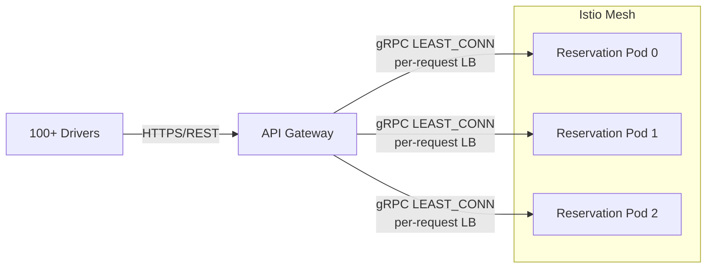
```mermaid
graph LR
    Drivers["100+ Drivers"]
    GW["API Gateway"]
    subgraph Istio Mesh
        RS0["Reservation Pod 0"]
        RS1["Reservation Pod 1"]
        RS2["Reservation Pod 2"]
    end
    Drivers -->|HTTPS/REST| GW
    GW -->|gRPC LEAST_CONN\nper-request LB| RS0
    GW -->|gRPC LEAST_CONN\nper-request LB| RS1
    GW -->|gRPC LEAST_CONN\nper-request LB| RS2
```

`LEAST_CONN` is preferred over `ROUND_ROBIN` because gRPC request durations vary — booking takes longer than availability check.

### Solution 2: RabbitMQ Consistent Hash Exchange for War Booking

Booking requests are enqueued and routed by `spot_id` hash — ensuring all requests for the same spot are processed **serially** by the same worker, eliminating race conditions.

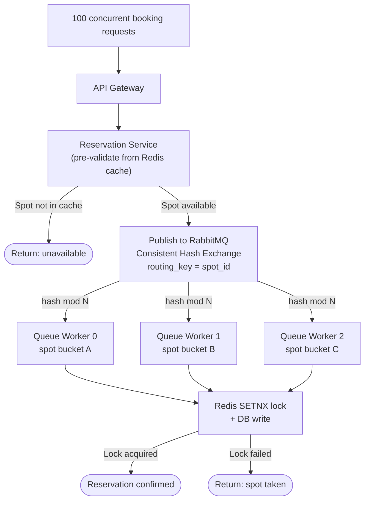
```mermaid
flowchart TD
    A["100 concurrent booking requests"] --> B["API Gateway"]
    B --> C["Reservation Service\n(pre-validate from Redis cache)"]
    C -->|"Spot not in cache"| D(["Return: unavailable"])
    C -->|"Spot available"| E["Publish to RabbitMQ\nConsistent Hash Exchange\nrouting_key = spot_id"]
    E -->|"hash mod N"| F["Queue Worker 0\nspot bucket A"]
    E -->|"hash mod N"| G["Queue Worker 1\nspot bucket B"]
    E -->|"hash mod N"| H["Queue Worker 2\nspot bucket C"]
    F --> I["Redis SETNX lock\n+ DB write"]
    G --> I
    H --> I
    I -->|"Lock acquired"| J(["Reservation confirmed"])
    I -->|"Lock failed"| K(["Return: spot taken"])
```

RabbitMQ exchange config:

```json
{
  "exchange": "booking.exchange",
  "type": "x-consistent-hash",
  "routing_key": "{spot_id}",
  "queues": 10
}
```

### Solution 3: Read/Write Separation

| Operation | Path |
|---|---|
| Availability check (read) | Redis cache (TTL 5–10s), no lock needed |
| Booking (write) | RabbitMQ queue → serial consumer → Redis SETNX → DB |

### Full Concurrency Architecture

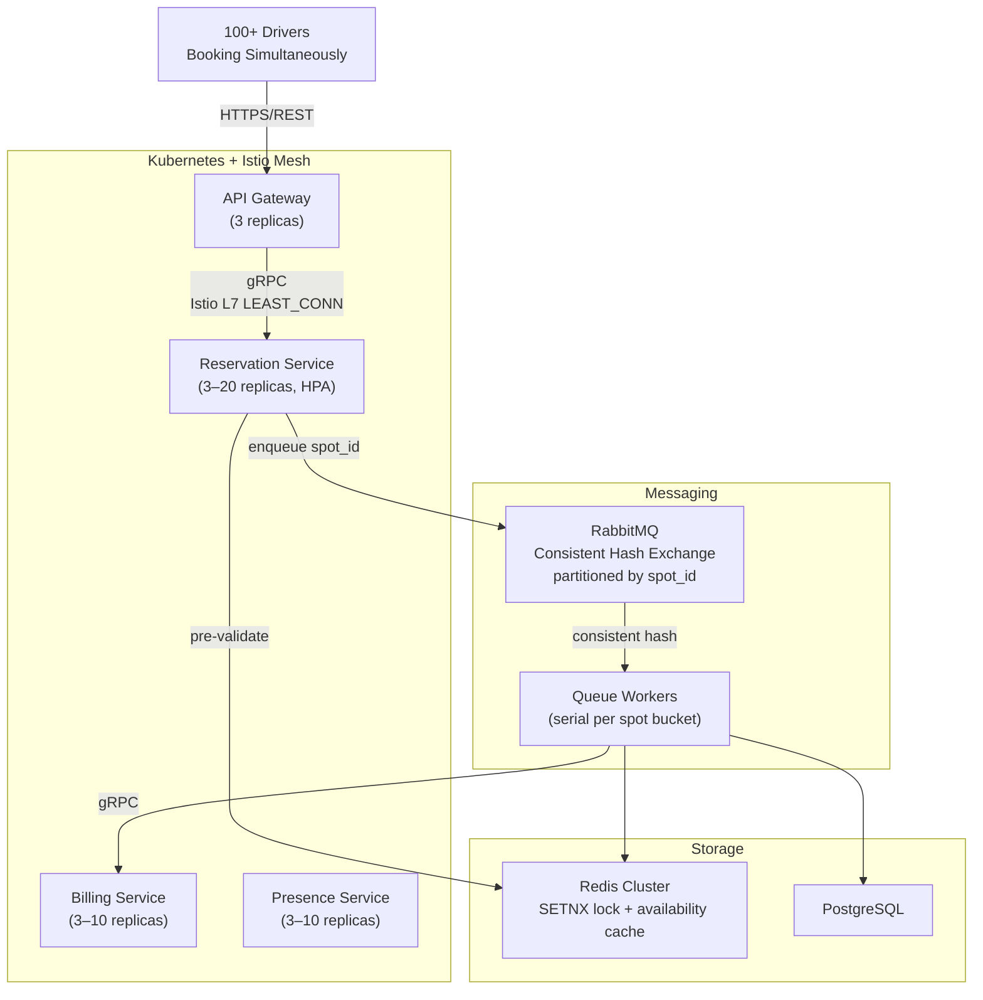
```mermaid
graph TD
    Drivers["100+ Drivers\nBooking Simultaneously"]

    subgraph Kubernetes + Istio Mesh
        GW["API Gateway\n(3 replicas)"]
        RS["Reservation Service\n(3–20 replicas, HPA)"]
        BS["Billing Service\n(3–10 replicas)"]
        PS["Presence Service\n(3–10 replicas)"]
    end

    subgraph Messaging
        RMQ["RabbitMQ\nConsistent Hash Exchange\npartitioned by spot_id"]
        WORKER["Queue Workers\n(serial per spot bucket)"]
    end

    subgraph Storage
        REDIS["Redis Cluster\nSETNX lock + availability cache"]
        PG["PostgreSQL"]
    end

    Drivers -->|"HTTPS/REST"| GW
    GW -->|"gRPC\nIstio L7 LEAST_CONN"| RS
    RS -->|pre-validate| REDIS
    RS -->|enqueue spot_id| RMQ
    RMQ -->|consistent hash| WORKER
    WORKER --> REDIS
    WORKER --> PG
    WORKER -->|gRPC| BS
```

---

## Kubernetes Deployment

> **Full operational guide**: Lihat [`sre/README.md`](./sre/README.md) untuk step-by-step setup dari Terraform sampai service running, termasuk troubleshooting, monitoring, CI/CD setup, dan teardown.

### Istio Setup

```bash
istioctl install --set profile=default -y
kubectl label namespace parkir-pintar istio-injection=enabled
```

### Reservation Service — Deployment & Service

```yaml
apiVersion: apps/v1
kind: Deployment
metadata:
  name: reservation-service
  namespace: parkir-pintar
spec:
  replicas: 3
  selector:
    matchLabels:
      app: reservation-service
  template:
    metadata:
      labels:
        app: reservation-service
        version: v1
    spec:
      containers:
        - name: reservation-service
          image: parkir-pintar/reservation-service:latest
          ports:
            - containerPort: 50051
              name: grpc
          resources:
            requests:
              cpu: 100m
              memory: 128Mi
            limits:
              cpu: 500m
              memory: 256Mi
---
apiVersion: v1
kind: Service
metadata:
  name: reservation-service
  namespace: parkir-pintar
spec:
  selector:
    app: reservation-service
  ports:
    - port: 50051
      targetPort: 50051
      name: grpc        # must be named "grpc" for Istio HTTP/2 detection
  type: ClusterIP
```

### Istio VirtualService + DestinationRule

```yaml
apiVersion: networking.istio.io/v1alpha3
kind: VirtualService
metadata:
  name: reservation-service
  namespace: parkir-pintar
spec:
  hosts:
    - reservation-service
  http:
    - timeout: 5s
      retries:
        attempts: 3
        perTryTimeout: 2s
        retryOn: unavailable,reset
      route:
        - destination:
            host: reservation-service
            port:
              number: 50051
---
apiVersion: networking.istio.io/v1alpha3
kind: DestinationRule
metadata:
  name: reservation-service
  namespace: parkir-pintar
spec:
  host: reservation-service
  trafficPolicy:
    loadBalancer:
      simple: LEAST_CONN
    connectionPool:
      http:
        http2MaxRequests: 1000
        maxRequestsPerConnection: 100
    outlierDetection:               # circuit breaker
      consecutive5xxErrors: 5
      interval: 10s
      baseEjectionTime: 30s
```

### HPA — Horizontal Pod Autoscaler

```yaml
apiVersion: autoscaling/v2
kind: HorizontalPodAutoscaler
metadata:
  name: reservation-service
  namespace: parkir-pintar
spec:
  scaleTargetRef:
    apiVersion: apps/v1
    kind: Deployment
    name: reservation-service
  minReplicas: 3
  maxReplicas: 20
  metrics:
    - type: Resource
      resource:
        name: cpu
        target:
          type: Utilization
          averageUtilization: 60
    - type: Pods
      pods:
        metric:
          name: grpc_server_handled_total
        target:
          type: AverageValue
          averageValue: 500
```

### mTLS — Istio PeerAuthentication

```yaml
apiVersion: security.istio.io/v1beta1
kind: PeerAuthentication
metadata:
  name: default
  namespace: parkir-pintar
spec:
  mtls:
    mode: STRICT    # all service-to-service must use mTLS, zero-code change needed
```

---

## Istio Service Mesh — Traffic Flow

Istio mesh covers **all intra-cluster communication**, including from Kong Gateway to downstream services. Every pod gets an Envoy sidecar injected automatically — so mTLS, L7 LB, retries, and circuit breaker apply uniformly with zero code changes.

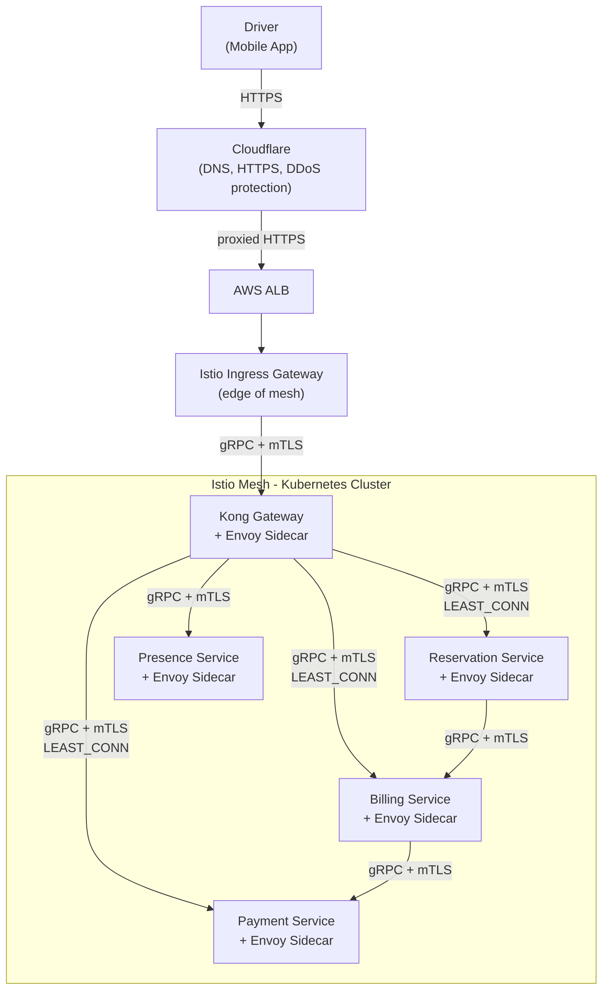
```mermaid
graph TD
    Driver["Driver\n(Mobile App)"]
    CF["Cloudflare\n(DNS, HTTPS, DDoS protection)"]
    ALB["AWS ALB"]
    IGW["Istio Ingress Gateway\n(edge of mesh)"]

    subgraph Istio Mesh - Kubernetes Cluster
        GW["Kong Gateway\n+ Envoy Sidecar"]
        RS["Reservation Service\n+ Envoy Sidecar"]
        BS["Billing Service\n+ Envoy Sidecar"]
        PS["Payment Service\n+ Envoy Sidecar"]
        PR["Presence Service\n+ Envoy Sidecar"]
    end

    Driver -->|HTTPS| CF
    CF -->|proxied HTTPS| ALB
    ALB --> IGW
    IGW -->|gRPC + mTLS| GW
    GW -->|gRPC + mTLS\nLEAST_CONN| RS
    GW -->|gRPC + mTLS\nLEAST_CONN| BS
    GW -->|gRPC + mTLS\nLEAST_CONN| PS
    GW -->|gRPC + mTLS| PR
    RS -->|gRPC + mTLS| BS
    BS -->|gRPC + mTLS| PS
```

Key points:
- **Driver → Cloudflare**: DNS resolution + HTTPS termination + DDoS protection
- **Cloudflare → ALB**: proxied HTTPS, origin IP hidden
- **ALB → Istio Ingress Gateway**: entry into mesh
- **All intra-mesh traffic**: gRPC + mTLS enforced by Istio `PeerAuthentication STRICT`
- **Kong Gateway** is a mesh member — its outbound calls go through Envoy sidecar, getting L7 LB + circuit breaker automatically

---

## Circuit Breaker Strategy

Circuit breaker can be applied at two levels. Both are used in this system for different purposes.

### Level 1: Istio `outlierDetection` (Mesh Level)

Configured in `DestinationRule`, Istio ejects unhealthy pods from the load balancing pool automatically.

```yaml
outlierDetection:
  consecutive5xxErrors: 5   # eject pod after 5 consecutive 5xx
  interval: 10s             # evaluation window
  baseEjectionTime: 30s     # how long pod stays ejected
```

| | Detail |
|---|---|
| **Pros** | Zero-code change; consistent across all services; integrated with Istio metrics & tracing; centralized config |
| **Cons** | Only detects HTTP 5xx — blind to business-level errors (e.g. payment returns 200 but body says failed); not portable without Istio |

### Level 2: `sony/gobreaker` (Code Level)

Applied in Go code specifically for **Payment** and **Notification** services — non-core services where business-level failure needs custom trip logic.

```go
cb := gobreaker.NewCircuitBreaker(gobreaker.Settings{
    MaxRequests: 3,
    Interval:    10 * time.Second,
    Timeout:     30 * time.Second,
    ReadyToTrip: func(counts gobreaker.Counts) bool {
        // trip on business error, not just HTTP 5xx
        return counts.ConsecutiveFailures > 5
    },
})
```

| | Detail |
|---|---|
| **Pros** | Custom trip logic based on business errors; portable without Istio; handles cases like payment gateway returning 200 with error body |
| **Cons** | State is per-pod — 10 replicas = 10 independent circuit breaker states, no shared state across pods; must be implemented manually per service |

### Why Both?

| Layer | Tool | Responsibility |
|---|---|---|
| Mesh (infra) | Istio `outlierDetection` | First line — eject bad pods based on 5xx, applies to all services automatically |
| Code (business) | `sony/gobreaker` | Second line — trip based on business logic errors, only on Payment Service (HTTP call to Pondo Ngopi settlement stub) & Notification (non-core) |

Istio handles **infrastructure-level failures** (pod crash, network error, 5xx). `gobreaker` handles **business-level failures** (payment gateway returns 200 but transaction failed, notification service degraded). Together they cover both failure dimensions without overlap.

---

## Pricing Engine: gorules (JDM)

Pricing rules are managed via [gorules](https://github.com/gorules/gorules) — a JDM-based rules engine for Go. Rules are stored in PostgreSQL and hot-reloaded by Billing Service without requiring a redeploy.

### Why gorules

| Concern | Solution |
|---|---|
| Rules change without redeploy | Hot-reload via polling DB every 30s |
| Non-engineer readable | Rules defined in JSON (JDM format) |
| Deterministic & testable | Pure input/output evaluation, no side effects |
| Decoupled from code | Rules stored in DB, not hardcoded |

### Hot-reload Flow

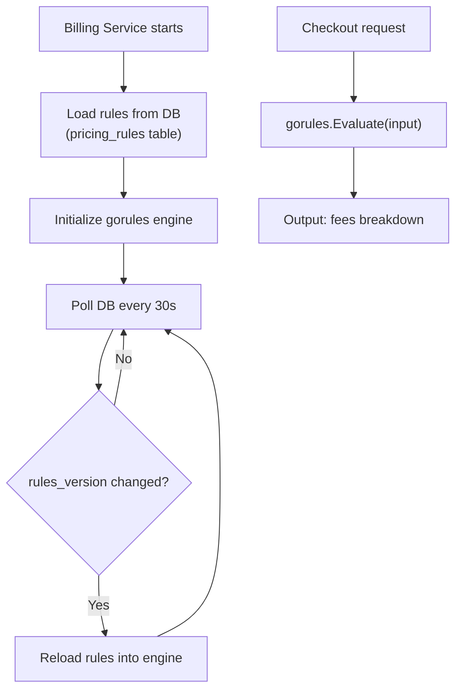
```mermaid
flowchart TD
    A["Billing Service starts"] --> B["Load rules from DB\n(pricing_rules table)"]
    B --> C["Initialize gorules engine"]
    C --> D["Poll DB every 30s"]
    D --> E{"rules_version changed?"}
    E -->|No| D
    E -->|Yes| F["Reload rules into engine"]
    F --> D
    G["Checkout request"] --> H["gorules.Evaluate(input)"]
    H --> I["Output: fees breakdown"]
```

### Rules DB Schema

```sql
CREATE TABLE pricing_rules (
    id          UUID PRIMARY KEY DEFAULT gen_random_uuid(),
    version     INT NOT NULL,
    name        VARCHAR(100) NOT NULL,
    content     JSONB NOT NULL,   -- JDM rule graph
    is_active   BOOLEAN DEFAULT true,
    created_at  TIMESTAMP DEFAULT now()
);
```

### JDM Rule — Pricing Input/Output

Input ke gorules engine:

```json
{
  "duration_hours": 3,
  "crosses_midnight": true,
  "midnight_crossings": 1,
  "is_noshow": false,
  "cancel_elapsed_minutes": 0
}
```

Output dari gorules engine:

```json
{
  "booking_fee": 5000,
  "hourly_fee": 15000,
  "overnight_fee": 20000,
  "cancellation_fee": 0,
  "noshow_fee": 0,
  "total": 40000
}
```

### Pricing Rules Summary (sebagai JDM nodes)

| Rule | Condition | Output |
|---|---|---|
| Booking fee | always on confirm | 5.000 IDR (charged separately, outside hourly) |
| Hourly fee | `ceil(duration_hours) * 5000` | variable |
| Overnight fee | `midnight_crossings * 20000` | 20.000 IDR flat per midnight crossing (kumulatif) |
| Cancel free | `cancel_elapsed_minutes <= 2` | 0 IDR |
| Cancel fee | `cancel_elapsed_minutes > 2` | 5.000 IDR |
| No-show fee | `is_noshow == true` | 10.000 IDR |
| Overstay | no condition | standard hourly rate applies, no penalty |
| Wrong spot | N/A | **BLOCKED** — driver cannot park at wrong spot |

### Billing Service — gorules Integration

```go
// load rules from DB
ruleContent, _ := db.GetActiveRule(ctx)
engine, _ := gorules.NewEngine(ruleContent)

// evaluate on checkout
result, _ := engine.Evaluate("pricing", map[string]any{
    "duration_hours":          3,
    "crosses_midnight":        true,
    "midnight_crossings":      1,
    "cancel_elapsed_minutes":  0,
    "is_noshow":               false,
})

// hot-reload goroutine
go func() {
    for range time.Tick(30 * time.Second) {
        latest, _ := db.GetActiveRule(ctx)
        if latest.Version != current.Version {
            engine.Reload(latest.Content)
            current = latest
        }
    }
}()
```

---

## API Gateway: Kong

Kong sits in front of the Istio mesh as the application-level gateway. It handles driver-facing concerns before traffic enters the mesh. Kong routes REST requests directly to each service's HTTP endpoint (port 8080) based on path prefix — no intermediary translation layer is needed.

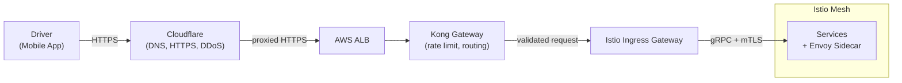
```mermaid
graph LR
    Driver["Driver\n(Mobile App)"]
    CF["Cloudflare\n(DNS, HTTPS, DDoS)"]
    ALB["AWS ALB"]
    KONG["Kong Gateway\n(rate limit, routing)"]
    IGW["Istio Ingress Gateway"]
    subgraph Istio Mesh
        SVC["Services\n+ Envoy Sidecar"]
    end

    Driver -->|HTTPS| CF
    CF -->|proxied HTTPS| ALB
    ALB --> KONG
    KONG -->|validated request| IGW
    IGW -->|gRPC + mTLS| SVC
```

Kong is deployed as a pod inside the cluster — it also gets Istio sidecar injected, so its outbound calls to services are covered by mTLS and L7 LB automatically.

| Kong Responsibility | Detail |
|---|---|
| Rate limiting | Per-driver request throttle to prevent abuse |
| Routing | Map REST path prefixes directly to per-service HTTP endpoints |
| Plugin ecosystem | Logging, CORS, request transformation |

---

## Presence Service: Location API & Check-in/Check-out

Presence Service mengelola location tracking dan check-in/check-out. Check-in dan check-out di-trigger melalui **unary API call**. Presence Service yang kemudian memanggil Billing.StartBillingSession untuk mulai menghitung waktu parkir.

### Unary API

Location update dikirim sebagai **regular API call** (unary RPC). App hit API setiap ≤30 detik untuk tracking.

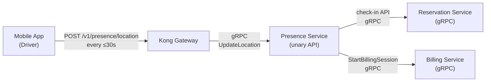
```mermaid
flowchart LR
    A["Mobile App\n(Driver)"]
    KONG["Kong Gateway"]
    P["Presence Service\n(unary API)"]
    R["Reservation Service\n(gRPC)"]
    B["Billing Service\n(gRPC)"]

    A -->|"POST /v1/presence/location\nevery ≤30s"| KONG
    KONG -->|"gRPC\nUpdateLocation"| P
    P -->|"check-in API\ngRPC"| R
    P -->|"StartBillingSession\ngRPC"| B
```

### Check-in/Check-out Flow

```
1. Driver app hits POST /v1/presence/location every ≤30s for tracking
2. Driver hits POST /v1/checkin with reservation_id + spot_id
3. Presence Service validates spot assignment:
   - Correct spot → calls Reservation.CheckIn (status=ACTIVE)
   - Correct spot → calls Billing.StartBillingSession (billing timer starts)
   - Wrong spot → BLOCKED, driver cannot park
4. On exit → Driver hits POST /v1/checkout/gate
5. Driver must pay before gate opens (payment before exit)
```

| | Detail |
|---|---|
| **Protocol** | Unary gRPC — simple request/response per location update |
| **Frequency** | App hit API setiap ≤30 detik selama sesi aktif |
| **Check-in trigger** | Presence Service owns check-in — calls Reservation + Billing |
| **Billing trigger** | Presence calls `Billing.StartBillingSession` saat check-in confirmed |

---


## Low Level Design (LLD)

### 1a. Reservation Flow — System-assigned Mode

Driver tidak memilih spot. Sistem langsung assign spot pertama yang tersedia sesuai vehicle type. Paling cepat karena tidak ada antrian hold.

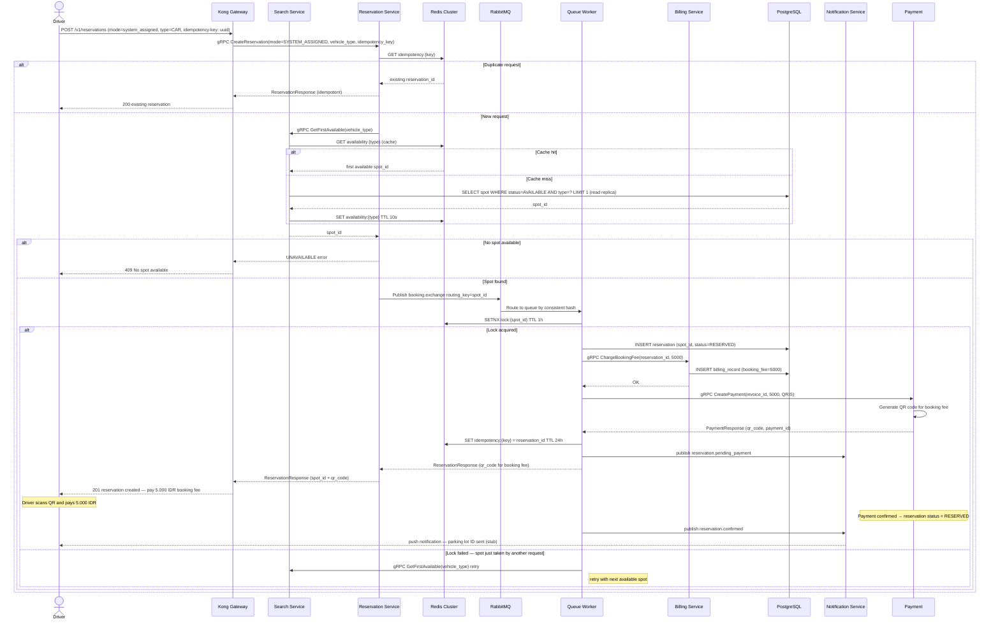
```mermaid
sequenceDiagram
    actor Driver
    participant Kong as Kong Gateway
    participant Search as Search Service
    participant Reservation as Reservation Service
    participant Redis as Redis Cluster
    participant RMQ as RabbitMQ
    participant Worker as Queue Worker
    participant Billing as Billing Service
    participant DB as PostgreSQL
    participant Notif as Notification Service

    Driver->>Kong: POST /v1/reservations (mode=system_assigned, type=CAR, idempotency-key: uuid)
    Kong->>Reservation: gRPC CreateReservation(mode=SYSTEM_ASSIGNED, vehicle_type, idempotency_key)

    Reservation->>Redis: GET idempotency:{key}
    alt Duplicate request
        Redis-->>Reservation: existing reservation_id
        Reservation-->>Kong: ReservationResponse (idempotent)
        Kong-->>Driver: 200 existing reservation
    else New request
        Reservation->>Search: gRPC GetFirstAvailable(vehicle_type)
        Search->>Redis: GET availability:{type} (cache)
        alt Cache hit
            Redis-->>Search: first available spot_id
        else Cache miss
            Search->>DB: SELECT spot WHERE status=AVAILABLE AND type=? LIMIT 1 (read replica)
            DB-->>Search: spot_id
            Search->>Redis: SET availability:{type} TTL 10s
        end
        Search-->>Reservation: spot_id

        alt No spot available
            Reservation-->>Kong: UNAVAILABLE error
            Kong-->>Driver: 409 No spot available
        else Spot found
            Reservation->>RMQ: Publish booking.exchange routing_key=spot_id
            RMQ->>Worker: Route to queue by consistent hash
            Worker->>Redis: SETNX lock:{spot_id} TTL 1h
            alt Lock acquired
                Worker->>DB: INSERT reservation (spot_id, status=RESERVED)
                Worker->>Billing: gRPC ChargeBookingFee(reservation_id, 5000)
                Billing->>DB: INSERT billing_record (booking_fee=5000)
                Billing-->>Worker: OK
                Worker->>Payment: gRPC CreatePayment(invoice_id, 5000, QRIS)
                Payment->>Payment: Generate QR code for booking fee
                Payment-->>Worker: PaymentResponse (qr_code, payment_id)
                Worker->>Redis: SET idempotency:{key} = reservation_id TTL 24h
                Worker->>Notif: publish reservation.pending_payment
                Worker-->>Reservation: ReservationResponse (qr_code for booking fee)
                Reservation-->>Kong: ReservationResponse (spot_id + qr_code)
                Kong-->>Driver: 201 reservation created — pay 5.000 IDR booking fee
                note over Driver: Driver scans QR and pays 5.000 IDR
                note over Payment: Payment confirmed → reservation status = RESERVED
                Worker->>Notif: publish reservation.confirmed
                Notif-->>Driver: push notification — parking lot ID sent (stub)
            else Lock failed — spot just taken by another request
                Worker->>Search: gRPC GetFirstAvailable(vehicle_type) retry
                note right of Worker: retry with next available spot
            end
        end
    end
```

### 1b. Reservation Flow — User-selected Mode

Driver memilih spot spesifik. Ada mekanisme FIFO hold sementara saat driver sedang di halaman pilih spot, untuk mencegah konflik antar driver yang memilih spot yang sama.

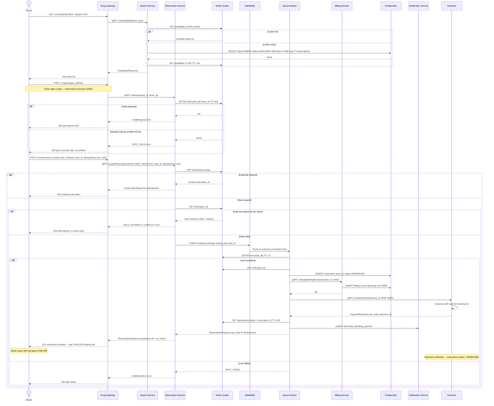
```mermaid
sequenceDiagram
    actor Driver
    participant Kong as Kong Gateway
    participant Search as Search Service
    participant Reservation as Reservation Service
    participant Redis as Redis Cluster
    participant RMQ as RabbitMQ
    participant Worker as Queue Worker
    participant Billing as Billing Service
    participant DB as PostgreSQL
    participant Notif as Notification Service

    Driver->>Kong: GET /v1/availability?floor=1&type=CAR
    Kong->>Search: gRPC GetAvailability(floor, type)
    Search->>Redis: GET availability:1:CAR (cache)
    alt Cache hit
        Redis-->>Search: available spots list
    else Cache miss
        Search->>DB: SELECT spots WHERE status=AVAILABLE AND floor=? AND type=? (read replica)
        DB-->>Search: spots
        Search->>Redis: SET availability:1:CAR TTL 10s
    end
    Search-->>Kong: AvailabilityResponse
    Kong-->>Driver: 200 spots list

    Driver->>Kong: POST /v1/spots/{spot_id}/hold
    note over Driver,Kong: Driver taps a spot — short hold to prevent conflict
    Kong->>Reservation: gRPC HoldSpot(spot_id, driver_id)
    Reservation->>Redis: SETNX hold:{spot_id} driver_id TTL 60s
    alt Hold acquired
        Redis-->>Reservation: OK
        Reservation-->>Kong: HoldResponse OK
        Kong-->>Driver: 200 spot held for 60s
    else Already held by another driver
        Redis-->>Reservation: HELD
        Reservation-->>Kong: SPOT_HELD error
        Kong-->>Driver: 409 spot currently held, try another
    end

    Driver->>Kong: POST /v1/reservations (mode=user_selected, spot_id, idempotency-key: uuid)
    Kong->>Reservation: gRPC CreateReservation(mode=USER_SELECTED, spot_id, idempotency_key)

    Reservation->>Redis: GET idempotency:{key}
    alt Duplicate request
        Redis-->>Reservation: existing reservation_id
        Reservation-->>Kong: ReservationResponse (idempotent)
        Kong-->>Driver: 200 existing reservation
    else New request
        Reservation->>Redis: GET hold:{spot_id}
        alt Hold not owned by this driver
            Redis-->>Reservation: hold owned by other / expired
            Reservation-->>Kong: HOLD_EXPIRED or CONFLICT error
            Kong-->>Driver: 409 hold expired, re-select spot
        else Hold valid
            Reservation->>RMQ: Publish booking.exchange routing_key=spot_id
            RMQ->>Worker: Route to queue by consistent hash
            Worker->>Redis: SETNX lock:{spot_id} TTL 1h
            alt Lock acquired
                Worker->>Redis: DEL hold:{spot_id}
                Worker->>DB: INSERT reservation (spot_id, status=RESERVED)
                Worker->>Billing: gRPC ChargeBookingFee(reservation_id, 5000)
                Billing->>DB: INSERT billing_record (booking_fee=5000)
                Billing-->>Worker: OK
                Worker->>Payment: gRPC CreatePayment(invoice_id, 5000, QRIS)
                Payment->>Payment: Generate QR code for booking fee
                Payment-->>Worker: PaymentResponse (qr_code, payment_id)
                Worker->>Redis: SET idempotency:{key} = reservation_id TTL 24h
                Worker->>Notif: publish reservation.pending_payment
                Worker-->>Reservation: ReservationResponse (qr_code for booking fee)
                Reservation-->>Kong: ReservationResponse (parking lot ID + qr_code)
                Kong-->>Driver: 201 reservation created — pay 5.000 IDR booking fee
                note over Driver: Driver scans QR and pays 5.000 IDR
                note over Payment: Payment confirmed → reservation status = RESERVED
            else Lock failed
                Worker-->>Reservation: SPOT_TAKEN
                Reservation-->>Kong: UNAVAILABLE error
                Kong-->>Driver: 409 Spot taken
            end
        end
    end
```

### Spot Assignment Mode — Redis Key Difference

| Mode | Redis Key saat Hold | Redis Key saat Confirmed |
|---|---|---|
| System-assigned | tidak ada hold key | `lock:{spot_id}` TTL 1h |
| User-selected | `hold:{spot_id}` TTL 60s | `lock:{spot_id}` TTL 1h, `hold` di-DEL |

### 2. Check-in Flow — via Presence Service API

Check-in di-trigger oleh API call ke Presence Service. Presence Service yang memvalidasi spot, memanggil Reservation.CheckIn, dan **memanggil Billing.StartBillingSession** untuk mulai menghitung waktu parkir. Wrong-spot **diblokir**.

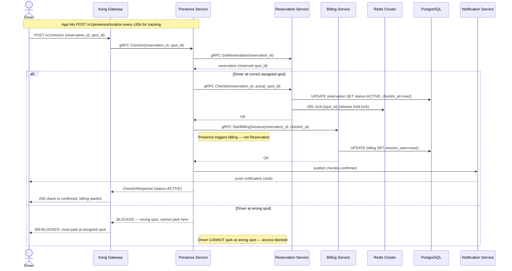
```mermaid
sequenceDiagram
    actor Driver
    participant Kong as Kong Gateway
    participant Presence as Presence Service
    participant Reservation as Reservation Service
    participant Billing as Billing Service
    participant Redis as Redis Cluster
    participant DB as PostgreSQL
    participant Notif as Notification Service

    note over Driver,Presence: App hits POST /v1/presence/location every ≤30s for tracking

    Driver->>Kong: POST /v1/checkin (reservation_id, spot_id)
    Kong->>Presence: gRPC CheckIn(reservation_id, spot_id)

    Presence->>Reservation: gRPC GetReservation(reservation_id)
    Reservation-->>Presence: reservation (reserved spot_id)

    alt Driver at correct assigned spot
        Presence->>Reservation: gRPC CheckIn(reservation_id, actual_spot_id)
        Reservation->>DB: UPDATE reservation SET status=ACTIVE, checkin_at=now()
        Reservation->>Redis: DEL lock:{spot_id} (release hold lock)
        Reservation-->>Presence: OK

        Presence->>Billing: gRPC StartBillingSession(reservation_id, checkin_at)
        note right of Presence: Presence triggers billing — not Reservation
        Billing->>DB: UPDATE billing SET session_start=now()
        Billing-->>Presence: OK

        Presence->>Notif: publish checkin.confirmed
        Notif-->>Driver: push notification (stub)
        Presence-->>Kong: CheckInResponse (status=ACTIVE)
        Kong-->>Driver: 200 check-in confirmed, billing started
    else Driver at wrong spot
        Presence-->>Kong: BLOCKED — wrong spot, cannot park here
        Kong-->>Driver: 409 BLOCKED: must park at assigned spot
        note right of Presence: Driver CANNOT park at wrong spot — access blocked
    end
```

### 3. Billing & Checkout Flow — Pay Before Exit

Driver harus bayar dulu sebelum bisa keluar area parkir. Overnight fee dihitung kumulatif per midnight crossing.

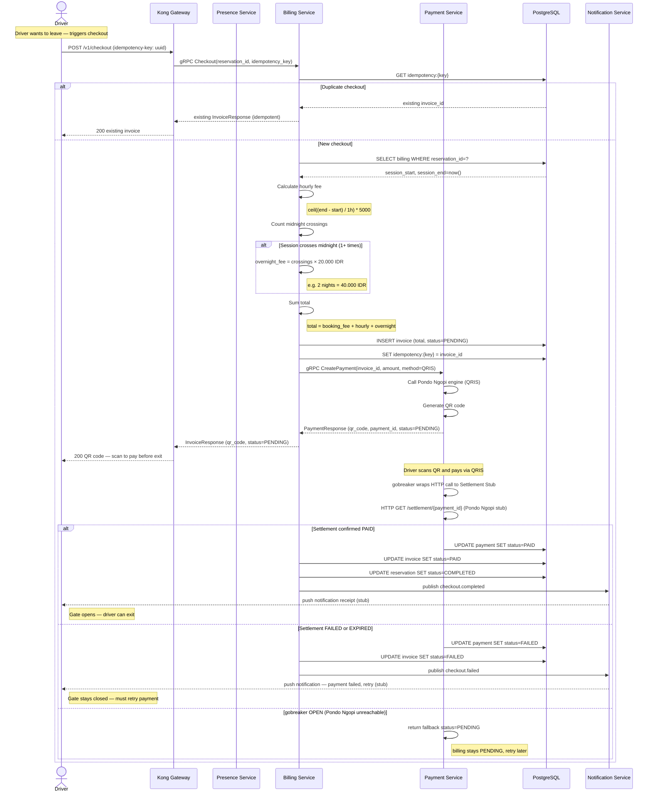
```mermaid
sequenceDiagram
    actor Driver
    participant Kong as Kong Gateway
    participant Presence as Presence Service
    participant Billing as Billing Service
    participant Payment as Payment Service
    participant DB as PostgreSQL
    participant Notif as Notification Service

    note over Driver: Driver wants to leave — triggers checkout
    Driver->>Kong: POST /v1/checkout (idempotency-key: uuid)
    Kong->>Billing: gRPC Checkout(reservation_id, idempotency_key)

    Billing->>DB: GET idempotency:{key}
    alt Duplicate checkout
        DB-->>Billing: existing invoice_id
        Billing-->>Kong: existing InvoiceResponse (idempotent)
        Kong-->>Driver: 200 existing invoice
    else New checkout
        Billing->>DB: SELECT billing WHERE reservation_id=?
        DB-->>Billing: session_start, session_end=now()

        Billing->>Billing: Calculate hourly fee
        note right of Billing: ceil((end - start) / 1h) * 5000

        Billing->>Billing: Count midnight crossings
        alt Session crosses midnight (1+ times)
            Billing->>Billing: overnight_fee = crossings × 20.000 IDR
            note right of Billing: e.g. 2 nights = 40.000 IDR
        end

        Billing->>Billing: Sum total
        note right of Billing: total = booking_fee + hourly + overnight

        Billing->>DB: INSERT invoice (total, status=PENDING)
        Billing->>DB: SET idempotency:{key} = invoice_id

        Billing->>Payment: gRPC CreatePayment(invoice_id, amount, method=QRIS)
        Payment->>Payment: Call Pondo Ngopi engine (QRIS)
        Payment->>Payment: Generate QR code
        Payment-->>Billing: PaymentResponse (qr_code, payment_id, status=PENDING)
        Billing-->>Kong: InvoiceResponse (qr_code, status=PENDING)
        Kong-->>Driver: 200 QR code — scan to pay before exit

        note over Payment: Driver scans QR and pays via QRIS

        Payment->>Payment: gobreaker wraps HTTP call to Settlement Stub
        Payment->>Payment: HTTP GET /settlement/{payment_id} (Pondo Ngopi stub)
        alt Settlement confirmed PAID
            Payment->>DB: UPDATE payment SET status=PAID
            Billing->>DB: UPDATE invoice SET status=PAID
            Billing->>DB: UPDATE reservation SET status=COMPLETED
            Billing->>Notif: publish checkout.completed
            Notif-->>Driver: push notification receipt (stub)
            note right of Driver: Gate opens — driver can exit
        else Settlement FAILED or EXPIRED
            Payment->>DB: UPDATE payment SET status=FAILED
            Billing->>DB: UPDATE invoice SET status=FAILED
            Billing->>Notif: publish checkout.failed
            Notif-->>Driver: push notification — payment failed, retry (stub)
            note right of Driver: Gate stays closed — must retry payment
        else gobreaker OPEN (Pondo Ngopi unreachable)
            Payment->>Payment: return fallback status=PENDING
            note right of Payment: billing stays PENDING, retry later
        end
    end
```

### 4. Cancellation Flow — Sequence Diagram

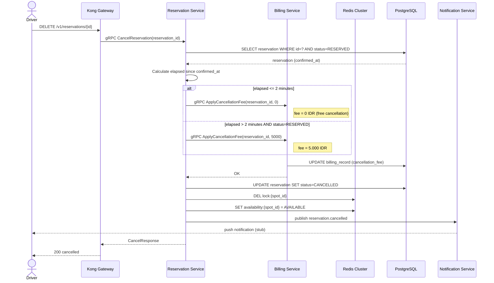
```mermaid
sequenceDiagram
    actor Driver
    participant Kong as Kong Gateway
    participant Reservation as Reservation Service
    participant Billing as Billing Service
    participant Redis as Redis Cluster
    participant DB as PostgreSQL
    participant Notif as Notification Service

    Driver->>Kong: DELETE /v1/reservations/{id}
    Kong->>Reservation: gRPC CancelReservation(reservation_id)

    Reservation->>DB: SELECT reservation WHERE id=? AND status=RESERVED
    DB-->>Reservation: reservation (confirmed_at)

    Reservation->>Reservation: Calculate elapsed since confirmed_at

    alt elapsed <= 2 minutes
        Reservation->>Billing: gRPC ApplyCancellationFee(reservation_id, 0)
        note right of Billing: fee = 0 IDR (free cancellation)
    else elapsed > 2 minutes AND status=RESERVED
        Reservation->>Billing: gRPC ApplyCancellationFee(reservation_id, 5000)
        note right of Billing: fee = 5.000 IDR
    end

    Billing->>DB: UPDATE billing_record (cancellation_fee)
    Billing-->>Reservation: OK

    Reservation->>DB: UPDATE reservation SET status=CANCELLED
    Reservation->>Redis: DEL lock:{spot_id}
    Reservation->>Redis: SET availability:{spot_id} = AVAILABLE
    Reservation->>Notif: publish reservation.cancelled
    Notif-->>Driver: push notification (stub)
    Reservation-->>Kong: CancelResponse
    Kong-->>Driver: 200 cancelled
```

### 5. Reservation Expiry (No-show) — Sequence Diagram

Jika Driver tidak check-in dalam 1 jam setelah masuk gerbang parkir (konfirmasi sistem), reservasi expired otomatis.

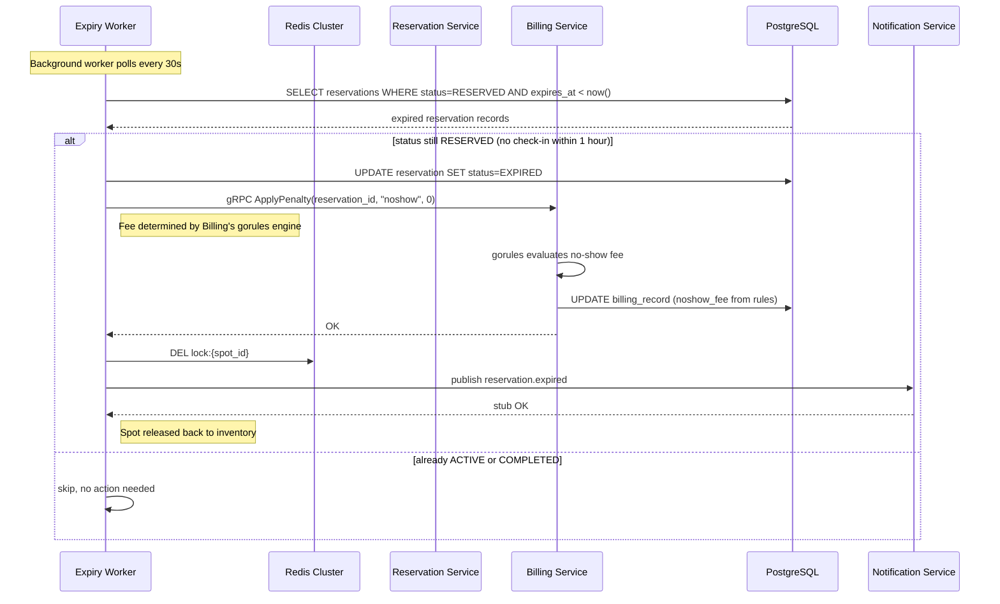
```mermaid
sequenceDiagram
    participant Worker as Expiry Worker
    participant Redis as Redis Cluster
    participant Reservation as Reservation Service
    participant Billing as Billing Service
    participant DB as PostgreSQL
    participant Notif as Notification Service

    note over Worker: Background worker polls every 30s
    Worker->>DB: SELECT reservations WHERE status=RESERVED AND expires_at < now()
    DB-->>Worker: expired reservation records

    alt status still RESERVED (no check-in within 1 hour)
        Worker->>DB: UPDATE reservation SET status=EXPIRED
        Worker->>Billing: gRPC ApplyPenalty(reservation_id, "noshow", 0)
        note right of Worker: Fee determined by Billing's gorules engine
        Billing->>Billing: gorules evaluates no-show fee
        Billing->>DB: UPDATE billing_record (noshow_fee from rules)
        Billing-->>Worker: OK
        Worker->>Redis: DEL lock:{spot_id}
        Worker->>Notif: publish reservation.expired
        Notif-->>Worker: stub OK
        note right of Worker: Spot released back to inventory
    else already ACTIVE or COMPLETED
        Worker->>Worker: skip, no action needed
    end
```

### 6. gRPC Service Contracts

```
SearchService
  rpc GetAvailability(GetAvailabilityRequest) returns (GetAvailabilityResponse)
  rpc GetFirstAvailable(GetFirstAvailableRequest) returns (GetFirstAvailableResponse)

ReservationService
  rpc CreateReservation(CreateReservationRequest) returns (ReservationResponse)
  rpc HoldSpot(HoldSpotRequest) returns (HoldSpotResponse)
  rpc CancelReservation(CancelReservationRequest) returns (CancelReservationResponse)
  rpc CheckIn(CheckInRequest) returns (CheckInResponse)
  rpc GetReservation(GetReservationRequest) returns (ReservationResponse)

BillingService
  rpc ChargeBookingFee(ChargeBookingFeeRequest) returns (BillingResponse)
  rpc StartBillingSession(StartBillingSessionRequest) returns (BillingResponse)
  rpc ApplyPenalty(ApplyPenaltyRequest) returns (BillingResponse)
  rpc Checkout(CheckoutRequest) returns (InvoiceResponse)

PaymentService
  rpc CreatePayment(CreatePaymentRequest) returns (PaymentResponse)
  rpc GetPaymentStatus(GetPaymentStatusRequest) returns (PaymentResponse)
  rpc RetryPayment(RetryPaymentRequest) returns (PaymentResponse)

PresenceService
  rpc UpdateLocation(LocationUpdate) returns (PresenceEvent)
  rpc CheckIn(CheckInRequest) returns (CheckInResponse)
  rpc CheckOut(CheckOutRequest) returns (CheckOutResponse)
```

### 7. Redis Key Schema

| Key Pattern | Value | TTL | Purpose |
|---|---|---|---|
| `lock:{spot_id}` | `reservation_id` | 1 hour | Inventory lock per spot (1 jam setelah masuk gerbang) |
| `hold:{spot_id}` | `driver_id` | 60s | Temporary hold for user-selected mode |
| `availability:{floor}:{type}` | JSON spots list | 10s | Read cache for availability |
| `idempotency:{key}` | `reservation_id / invoice_id` | 24h | Idempotency dedup |
| `session:{reservation_id}` | `checkin_at` | 24h | Active session tracker |

### 8. Component Diagram

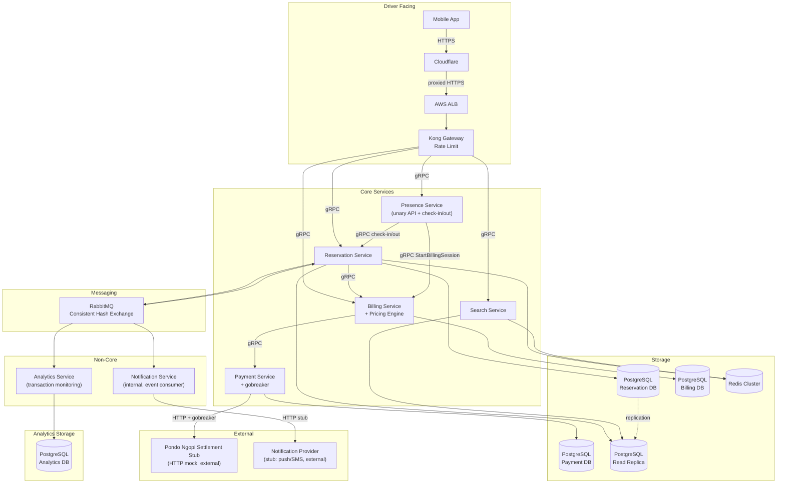
```mermaid
graph TD
    subgraph Driver Facing
        APP["Mobile App"]
        CF["Cloudflare"]
        ALB["AWS ALB"]
        KONG["Kong Gateway\nRate Limit"]
    end

    subgraph Core Services
        SEARCH["Search Service"]
        RESERVATION["Reservation Service"]
        BILLING["Billing Service\n+ Pricing Engine"]
        PAYMENT["Payment Service\n+ gobreaker"]
        PRESENCE["Presence Service\n(unary API + check-in/out)"]
    end

    subgraph Non-Core
        NOTIF["Notification Service\n(internal, event consumer)"]
        ANALYTICS["Analytics Service\n(transaction monitoring)"]
    end

    subgraph External
        SETTLEMENT["Pondo Ngopi Settlement Stub\n(HTTP mock, external)"]
        NOTIF_PROVIDER["Notification Provider\n(stub: push/SMS, external)"]
    end

    subgraph Analytics Storage
        PG_AN[("PostgreSQL\nAnalytics DB")]
    end

    subgraph Messaging
        RMQ["RabbitMQ\nConsistent Hash Exchange"]
    end

    subgraph Storage
        PG_RES[("PostgreSQL\nReservation DB")]
        PG_BIL[("PostgreSQL\nBilling DB")]
        PG_PAY[("PostgreSQL\nPayment DB")]
        PG_R[("PostgreSQL\nRead Replica")]
        REDIS[("Redis Cluster")]
    end

    APP -->|HTTPS| CF
    CF -->|proxied HTTPS| ALB
    ALB --> KONG
    KONG -->|gRPC| SEARCH
    KONG -->|gRPC| RESERVATION
    KONG -->|gRPC| BILLING
    KONG -->|gRPC| PRESENCE

    RESERVATION --> RMQ
    RMQ --> RESERVATION
    RESERVATION -->|gRPC| BILLING
    BILLING -->|gRPC| PAYMENT
    PRESENCE -->|gRPC check-in/out| RESERVATION
    PRESENCE -->|gRPC StartBillingSession| BILLING

    RESERVATION --> REDIS
    RESERVATION --> PG_RES
    RESERVATION --> PG_R
    BILLING --> PG_BIL
    PAYMENT --> PG_PAY
    SEARCH --> REDIS
    SEARCH --> PG_R

    PG_RES -.->|replication| PG_R

    RMQ --> NOTIF
    RMQ --> ANALYTICS
    PAYMENT -->|HTTP + gobreaker| SETTLEMENT
    NOTIF -->|HTTP stub| NOTIF_PROVIDER
    ANALYTICS --> PG_AN
```

---


## Entity Relationship Diagram (ERD)

Setiap service punya database sendiri. Tidak ada foreign key lintas service — relasi antar service hanya lewat event (RabbitMQ) atau gRPC call.

### Reservation DB

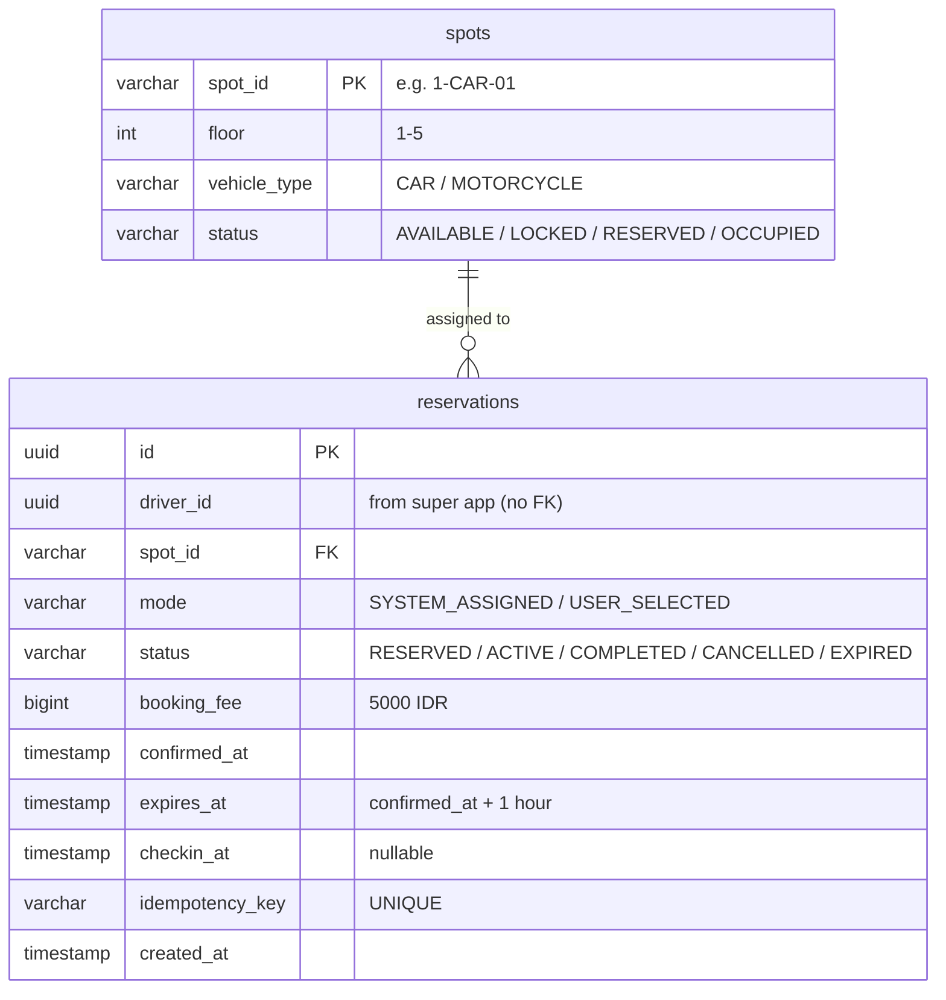
```mermaid
erDiagram
    spots {
        varchar spot_id PK "e.g. 1-CAR-01"
        int floor "1-5"
        varchar vehicle_type "CAR / MOTORCYCLE"
        varchar status "AVAILABLE / LOCKED / RESERVED / OCCUPIED"
    }

    reservations {
        uuid id PK
        uuid driver_id "from super app (no FK)"
        varchar spot_id FK
        varchar mode "SYSTEM_ASSIGNED / USER_SELECTED"
        varchar status "RESERVED / ACTIVE / COMPLETED / CANCELLED / EXPIRED"
        bigint booking_fee "5000 IDR"
        timestamp confirmed_at
        timestamp expires_at "confirmed_at + 1 hour"
        timestamp checkin_at "nullable"
        varchar idempotency_key "UNIQUE"
        timestamp created_at
    }

    spots ||--o{ reservations : "assigned to"
```

### Billing DB

```mermaid
erDiagram
    billing_records {
        uuid id PK
        uuid reservation_id "ref to Reservation DB (no FK)"
        bigint booking_fee "5000 IDR — charged on confirm, outside hourly"
        bigint hourly_fee "ceil(hours) * 5000"
        bigint overnight_fee "crossings * 20000"
        bigint penalty "0 — wrong spot is blocked"
        bigint noshow_fee "10000 if no-show"
        bigint cancellation_fee "0 or 5000"
        bigint total
        varchar status "PENDING / PAID / FAILED"
        timestamp session_start "nullable"
        timestamp session_end "nullable"
        varchar idempotency_key "UNIQUE"
        uuid payment_id "nullable"
        text qr_code "nullable"
        timestamp created_at
    }

    pricing_rules {
        uuid id PK
        int version
        varchar name
        jsonb content "JDM rule graph"
        boolean is_active
        timestamp created_at
    }
```

### Payment DB

```mermaid
erDiagram
    payments {
        uuid id PK
        uuid invoice_id "ref to Billing DB (no FK)"
        varchar method "QRIS"
        bigint amount
        varchar status "PENDING / PAID / FAILED"
        text qr_code
        varchar idempotency_key
        timestamp created_at
        timestamp updated_at
    }
```

### Analytics DB

```mermaid
erDiagram
    transaction_events {
        uuid id PK
        varchar event_type "reservation.confirmed / checkout.completed / etc"
        uuid reservation_id "denormalized"
        uuid driver_id "denormalized"
        varchar spot_id "denormalized"
        varchar vehicle_type "denormalized"
        bigint amount "nullable"
        jsonb payload "full event payload"
        timestamp event_at
    }
```

### Cross-service Reference Summary

Karena database per service, tidak ada foreign key lintas DB. Referensi antar service dilakukan via ID yang di-pass lewat event atau gRPC:

| Field | Ada di Service | Merujuk ke |
|---|---|---|
| `billing_records.reservation_id` | Billing DB | Reservation DB |
| `payments.invoice_id` | Payment DB | Billing DB |
| `transaction_events.reservation_id` | Analytics DB | Reservation DB |
| `transaction_events.driver_id` | Analytics DB | Reservation DB |
| `reservations.driver_id` | Reservation DB | (external, from super app) |

---

## API Documentation (Swagger)

OpenAPI 3.0 spec: [`sre/e2e/swagger.yaml`](./sre/e2e/swagger.yaml)

```bash
# Preview with Redocly
npx @redocly/cli preview-docs sre/e2e/swagger.yaml

# Preview with Swagger UI (Docker)
docker run -p 8080:8080 -e SWAGGER_JSON=/spec/swagger.yaml \
  -v $(pwd)/sre/e2e:/spec swaggerapi/swagger-ui
```

---

## E2E Testing (Newman)

### Prerequisites

```bash
npm install -g newman
```

### Quick Run

```bash
# Run full E2E suite against production
newman run sre/e2e/parkir-pintar.postman_collection.json \
  -e sre/e2e/parkir-pintar.postman_environment.json

# Run against custom environment
newman run sre/e2e/parkir-pintar.postman_collection.json \
  -e sre/e2e/parkir-pintar.postman_environment.json \
  --env-var base_url=http://localhost:8080

# Run with HTML report
npm install -g newman-reporter-htmlextra
newman run sre/e2e/parkir-pintar.postman_collection.json \
  -e sre/e2e/parkir-pintar.postman_environment.json \
  --reporters cli,htmlextra \
  --reporter-htmlextra-export sre/e2e/report.html

# Run specific folder only
newman run sre/e2e/parkir-pintar.postman_collection.json \
  -e sre/e2e/parkir-pintar.postman_environment.json \
  --folder "1. Search"
```

### Architecture

```
Client (Newman/Postman)
  → Cloudflare (HTTPS)
    → Kong Gateway (rate limiting, path-based routing)
      → Per-service HTTP endpoints (Search :8080, Reservation :8080, Billing :8080, Payment :8080, Presence :8080)
```

Kong routes REST requests directly to each service's HTTP endpoint based on path prefix. Each service exposes its own HTTP handler (port 8080) alongside gRPC, allowing standard HTTP testing tools (Postman, Newman, curl) to interact with the services without an intermediary translation layer.

### REST API Endpoints

| Method | Endpoint | Service | gRPC Method |
|--------|----------|---------|-------------|
| GET | `/v1/availability?floor=&vehicle_type=` | Search | GetAvailability |
| GET | `/v1/availability/first?vehicle_type=` | Search | GetFirstAvailable |
| POST | `/v1/spots/{spot_id}/hold` | Reservation | HoldSpot |
| POST | `/v1/reservations` | Reservation | CreateReservation |
| GET | `/v1/reservations/{id}` | Reservation | GetReservation |
| DELETE | `/v1/reservations/{id}` | Reservation | CancelReservation |
| POST | `/v1/checkin` | Presence | CheckIn |
| POST | `/v1/presence/location` | Presence | UpdateLocation |
| POST | `/v1/checkout` | Billing | Checkout |
| POST | `/v1/checkout/gate` | Presence | CheckOut |
| GET | `/v1/payments/{id}` | Payment | GetPaymentStatus |
| POST | `/v1/payments/{id}/retry` | Payment | RetryPayment |

### E2E Test Scenarios

The Postman collection runs sequentially — variables are chained between steps.

| # | Folder | Scenario | Assertions |
|---|--------|----------|------------|
| 1 | Search | Get availability per floor + first available spot | Status 200, spots array, total_available > 0 |
| 2 | Hold Spot | Hold a spot (60s TTL) + double-hold conflict (409) | Status 200 + 409 |
| 3 | Reservation | Create SYSTEM_ASSIGNED + idempotency check | Status 201, booking_fee=5000, same key → same result |
| 4 | Check-in | Check-in at correct spot via Presence | Status 200, status=ACTIVE, wrong_spot=false |
| 5 | Location | Update driver location | Status 200, event field present |
| 6 | Checkout | Generate invoice + QRIS QR code | invoice_id, payment_id, total > 0, status=PENDING |
| 7 | Payment | Get payment status + retry if failed | status ∈ {PENDING, PAID, FAILED} |
| 8 | Cancel | Create + cancel reservation | status=CANCELLED |
| 9 | Exit Gate | CheckOut (open gate) | status field present |

### Postman Import

To run tests interactively in Postman:

1. Open Postman → Import
2. Import `sre/e2e/parkir-pintar.postman_collection.json`
3. Import `sre/e2e/parkir-pintar.postman_environment.json`
4. Select "ParkirPintar E2E" environment
5. Run collection sequentially (Runner → select collection → Run)

### curl Examples

```bash
# Search availability
curl -s https://parkir-pintar.pondongopi.biz.id/v1/availability?floor=1\&vehicle_type=CAR | jq

# Hold a spot
curl -s -X POST https://parkir-pintar.pondongopi.biz.id/v1/spots/1-CAR-05/hold \
  -H "Content-Type: application/json" \
  -d '{"driver_id": "550e8400-e29b-41d4-a716-446655440000"}'

# Create reservation
curl -s -X POST https://parkir-pintar.pondongopi.biz.id/v1/reservations \
  -H "Content-Type: application/json" \
  -H "Idempotency-Key: $(uuidgen)" \
  -d '{"driver_id":"550e8400-e29b-41d4-a716-446655440000","mode":"SYSTEM_ASSIGNED","vehicle_type":"CAR"}'
```

### Unit Test Coverage

| Service | Test File | Coverage |
|---|---|---|
| Billing | `billing_usecase_test.go` | Checkout happy path, idempotency, payment failure, graceful degradation, no-show fee, penalty |
| Billing | `pricing.go` (JDM engine) | Pricing rules via gorules: hourly, overnight, cancellation, no-show |
| Payment | `payment_usecase_test.go` | Create payment, idempotency, circuit breaker fallback |
| Payment | `settlement_client_test.go` | Settlement HTTP client, error handling |
| Billing | `publisher_test.go` | Event publishing to RabbitMQ |
| Billing | `payment_client_test.go` | gRPC payment client adapter |

### Integration Tests

Integration tests are located in `sre/e2e/integration/` and test the reservation → billing flow end-to-end using real gRPC calls between services.

---

## Third-Party Libraries & Justification

### Framework Decision

Berdasarkan evaluasi antara Golang Native, Beego, dan GoFr:

| Kriteria | Beego | GoFr | Golang Native |
|---|---|---|---|
| Konfigurasi | Instan | Instan | Manual |
| Dokumentasi | Tidak selalu update | Lengkap | Lengkap (official) |
| Fleksibilitas | Terbatas | Terbatas | Penuh |
| Kompatibilitas protokol | HTTP only | HTTP + gRPC | HTTP, gRPC, WebSocket |
| Performa (p95 latency) | 3.156ms | 6.58ms | **1.595ms** |
| Binary size | 18M | 43M | **11M** |
| Total Score | 27 | 27 | **32** |

**Keputusan: Golang Native** — karena sistem ini heavily gRPC (bukan REST CRUD biasa), dan performa serta binary size paling optimal. Framework seperti GoFr/Beego justru menambah overhead tanpa benefit signifikan untuk usecase ini.

- Semua service-to-service: **gRPC native** via `google.golang.org/grpc`
- Presence Service: **unary gRPC API** untuk location tracking dan check-in/check-out

---

### Libraries from Recommended List

| # | Category | Library | Version | Justification |
|---|---|---|---|---|
| 1 | Logging | [zerolog](https://github.com/rs/zerolog) | latest | Structured logging (JSON format, zero-allocation). Dipakai di semua service untuk structured logging |
| 2 | Configuration | Environment variables + `os.Getenv` | stdlib | Load config dari env vars yang di-inject via K8s ConfigMap/Secret |
| 3 | Monitoring | [Prometheus client](https://github.com/prometheus/client_golang) | latest | Expose `/metrics` endpoint di setiap service. Dipakai bersama Grafana untuk infra/app monitoring |
| 4 | RDBMS | [pgx](https://github.com/jackc/pgx) | v5 | PostgreSQL driver dengan connection pooling (pgxpool). Dipakai di semua service yang punya DB |
| 5 | Key-value | [go-redis](https://github.com/redis/go-redis) | v9 | Client Redis untuk SETNX inventory lock, hold key, idempotency key, availability cache |
| 6 | Queue | [amqp091-go](https://github.com/rabbitmq/amqp091-go) | latest | Official RabbitMQ client untuk Go. Dipakai di Reservation (publish), Notification/Analytics (consume) |
| 7 | Unit Test | Standard `testing` package | stdlib | Unit test untuk pricing engine, idempotency, billing usecase |
| 8 | Concurrency | Standard library (Goroutines) | stdlib | Hot-reload goroutine di Billing, background expiry worker, queue worker |
| 9 | JSON | Standard library (`encoding/json`) | stdlib | Parse/build JSON payload untuk event messages, gorules input/output |
| 10 | Packaging | Go modules (`go mod`) + Go workspace (`go.work`) | stdlib | Dependency management untuk semua service dalam monorepo |

### Libraries Outside Recommended List

| Category | Library | Version | Justification |
|---|---|---|---|
| gRPC | [google.golang.org/grpc](https://github.com/grpc/grpc-go) | latest | Core requirement — semua service-to-service communication pakai gRPC over HTTP/2 |
| gRPC Protobuf | [google.golang.org/protobuf](https://github.com/protocolbuffers/protobuf-go) | latest | Code generation dari `.proto` files untuk semua gRPC service contracts |
| Circuit Breaker | [sony/gobreaker](https://github.com/sony/gobreaker) | v2 | Circuit breaker di Payment Service (HTTP call ke Pondo Ngopi settlement stub) |
| Pricing Engine | [gorules/gorules](https://github.com/gorules/gorules) | latest | JDM-based rules engine untuk pricing calculation. Rules disimpan di DB, hot-reload tanpa redeploy |
| OpenTelemetry | [go.opentelemetry.io/otel](https://github.com/open-telemetry/opentelemetry-go) | latest | Distributed tracing antar service. Trace context di-propagate via gRPC metadata |
| UUID | [google/uuid](https://github.com/google/uuid) | latest | Generate UUID untuk reservation ID, invoice ID, payment ID, idempotency key |
| DB Migration | [golang-migrate/migrate](https://github.com/golang-migrate/migrate) | v4 | Schema migration untuk semua PostgreSQL DB per service |

---

## Reusable Components

| Component | Location | Description |
|---|---|---|
| Pricing Engine | `services/billing/internal/usecase/pricing.go` | Pure Go pricing engine dengan gorules/JDM support. Hot-reload dari DB setiap 30s |
| Redis-based Lock | `services/reservation/internal/repository/` | `SETNX` + TTL untuk inventory lock per spot. Dipakai untuk double-booking prevention |
| Streaming Presence | `services/presence/` | Unary gRPC API untuk location update setiap ≤30s. Owns check-in trigger — calls Reservation.CheckIn + Billing.StartBillingSession |
| Config Loader | Per-service `cmd/main.go` | `buildDatabaseURL()`, `buildRedisAddr()`, `buildGRPCAddr()` — compose connection strings dari K8s env vars |
| Structured Logging | All services | zerolog dengan JSON format, ConsoleWriter untuk dev, integrated dengan OpenTelemetry |
| Event Publisher | `services/*/internal/adapter/publisher.go` | RabbitMQ event publisher untuk domain events (reservation.confirmed, checkout.completed, etc.) |
| Idempotency | Redis-based per service | Idempotency key stored in Redis with 24h TTL, checked before processing CreateReservation and Checkout |
| Circuit Breaker | `services/payment/internal/usecase/` | `sony/gobreaker` wrapping HTTP calls to Pondo Ngopi settlement stub |
